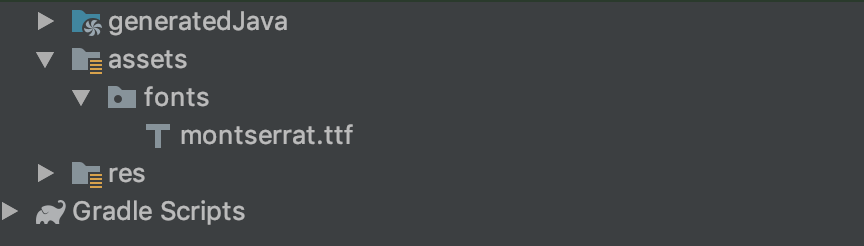
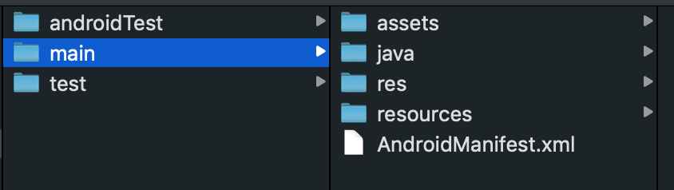

Given your design requires the fonts in your app to have some specific font, this is how you use some custom fonts while developing your app.

This is better done at the start of the project, otherwise you're looking at a lot of refactoring.

- First and foremost is to put the font file in your assets folder of your app.
  If you can't find one, just go ahead and create one in the 'main' folder of your app.
  
  <br/>
  
- Then create a new class in your app that extends TextView class.

```java
public class CustomTextView extends android.support.v7.widget.AppCompatTextView {
    public CustomTextView(Context context) {
        super(context);
        setFont();
    }

    public CustomTextView(Context context, AttributeSet attrs) {
        super(context, attrs);
        setFont();
    }

    public CustomTextView(Context context, AttributeSet attrs, int defStyleAttr) {
        super(context, attrs, defStyleAttr);
        setFont();
    }

    private void setFont() {
        setTypeface(Typeface.createFromAsset(getContext().getAssets(), "fonts/montserrat.ttf"), Typeface.NORMAL);
    }
}

```

- Here in _setFont()_ method you can see that we're setting out custom font to our text view class.
- Then in your xml files, use this class as follows:

```xml
<?xml version="1.0" encoding="utf-8"?>
<LinearLayout xmlns:android="http://schemas.android.com/apk/res/android"
    xmlns:app="http://schemas.android.com/apk/res-auto"
    xmlns:tools="http://schemas.android.com/tools"
    android:layout_width="match_parent"
    android:layout_height="match_parent">

    <TextView
        android:layout_width="wrap_content"
        android:layout_height="wrap_content"
        android:text="Hello World!"/>

    <com.yourpackagename.CustomTextView
        android:layout_width="wrap_content"
        android:layout_height="wrap_content"
        android:text="Custom text" />

</LinearLayout>
```

- The result:
  
