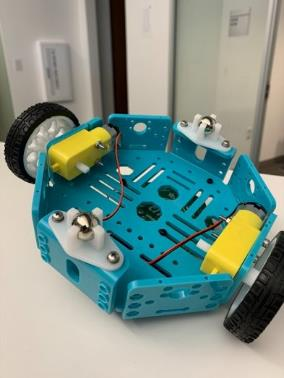

In the last lesson we attached the Bluefruit board to the Crickit. Now let's build the rest of the robot.

# Assembly Video

[Assembly Walkthrough](https://video.morganstanley.com/#/videos/502f9fb8-00cc-4b84-950d-110df6d1edc4)

**Supplies Needed:**

- Battery pack
- 3 AA batteries
- Bluefruit board
- Crickit
- 2 Motors
- 2 Wheels
- Robot Chassis
- 4 Long M3 Bolts + Nuts
- 4 Short M3 Bolts + Nuts
- 3 Black Nylon Spacers, Screws, and Nuts

# Attach Motors

- Attach one motor to each side
- Use M3 X 30 MM screws and M3 nuts \(Small box\)\.
- Thread Motor Wires up through chassis
- Attach caster wheels
- Attach caster wheels to each side
- Use M3 X 16 MM screws and M3 nuts \(Big box\)

# Attach Bluefruit / Crickit to Robot Body

- Nylon spacers male to female \(M3X20 mm\)
- Nylon screws \(M3 X 12 mm\)
- Nylon nuts \(M3\)

# Attach motor wires and power supply

- Attach motor wires and power supply to crickit
- Screw the motor wire leads into the ports\.
- Black\, Red\, Black\, Red
- Run the power supply under the body and up to the power supply port

