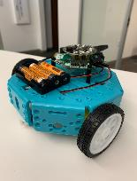
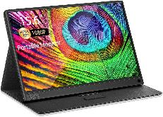
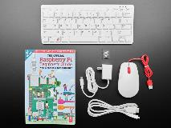
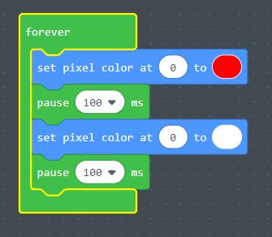

# MakeCode Robotics Overview

- Students will Learn:

  - **MakeCode** : Learn to program CPX microchip using a "drag and drop" MakeCode interface
  - **Robotics** : Introduction to robotics using CPX and Crickit microchips.
  - **Raspberry Pi Computer** : Using this world\-famous Linux based Computer as your personal laptop

- Tools we'll use
  - Adafruit CircuitPlaygroundExpress
  - External Display & Raspberry Pi 400 Desktop Computer Kit
  - Crickit Motors and robot body

# Overview of CPX Features

- 10 Mini NeoPixel LEDs, each one can display any rainbow color
- Accelerometer with Tap and Free\-Fall Detection
- Temperature Sensor
- Light Sensor
- Sound Sensor
- Infrared Transmitter and Receiver
- Mini speaker
- 2 push buttons, left and right
- Slide Switch
- 7 pads can act as Capacitive Touch input and more...

# Overview of Adafruit Makecode Interface

https://makecode.adafruit.com/

# Device Setup

# Raspberry Pi Setup

- General Powerup\.
  - Connect Power cord\, USB Mouse\, Display with HDMI cable and additional micro\-to\-hdmi adapter\.
  - The Raspberry Pi will come on automatically upon power is connected\.
  - Please skip the operating system update\. This typically takes at least 30 minutes\.
  - Refer to this YouTube Video on how to connect everything:
    - [Connect Raspberry Pi to Portable Display](https://youtu.be/J42xo_hkbhM)
  - _Changing Wireless network and Verify Internet Connection_
    - Choose Wireless network by choosing WiFi icon on the top right\-hand corner\. Icon is next to Bluetooth icon\. 
    - Choose your WiFi network and enter network password if one is assigned for the network\.
    - Verify that Raspberry Pi is connected to WiFi and able to access Internet\.
    - Start Chromium internet browser from top left\-hand menu\. Icon look like a Globe with Blue color 
    - Enter any URL

# CPX Microchip Setup

- Connect CPX
  - Take the USB cable and connect it to the Raspberry Pi\.
  - Attach the CPX device to the other end of USB cable\.
  - Press the RESET button on the CPX device\. Reset button is the center of the CPX device and is small button\.
  - The device will light up all GREEN\.
  - Click Files icon from top left hand menu bar\. 
  - You should see CPLAYBOOT as one of the folders\.
- Start Chromium internet browser from top left hand menu\.
  - Type [https://makecode\.adafruit\.com](https://makecode.adafruit.com/) in the browser\.
- Start New Project By Clicking 
- Check YouTube Video on creating sample Makecode program and download to CPX: _[Sample program on Adafruit CPX using ](https://youtu.be/DtwpVIRUKzg)_ [Makecode](https://youtu.be/DtwpVIRUKzg)

# Quick Start Example - Red Light

_CPX Device_

_MakeCode_

# Setup Instructions - Download

Select Download \(pink button\)

Setup Instructions

Click and drag the file to CPLAYBOOT
