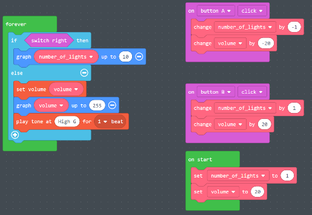
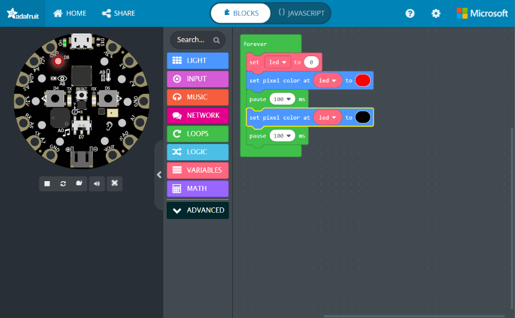
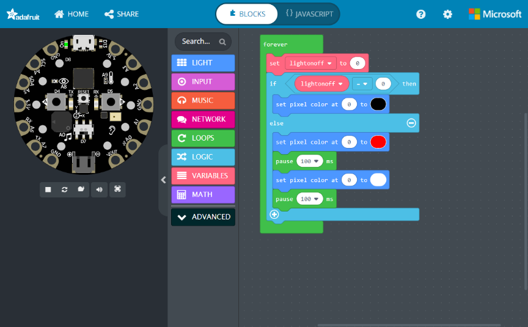

# Variables

- What is a variable?
  - A variable is used to store information inside a computer program.
  - These variables have descriptive names and can later be referenced within the program to retrieve the information they store.
- What are some examples of variables?
  - Weather = sunny
  - Light = red
  - The variable names weather and light reference the stored values.
- What are variables in daily life?
  - Something that changes like the weather, the time, someone is standing or sitting?
  - Volume on headphones

# Example (live intro by instructor)

[https://makecode.com/\_Jj17e3CiEetw](https://makecode.com/_Jj17e3CiEetw)

# Variables Example

- This is an example of how to create a variable called "exampleVariable"
- Click on the variables tab and select "Make a variable"
- After that you can select to "set" the variable to a value.
- Drag the exampleVariable onto the "set pixel color" function.

# Variables Exercise #1

- For this exercise attempt to make the led light at position "0" blink red continuously.
- Use a forever loop to make the light blink forever.
- Create a variable called "led" and set it to the value of "0".
- Make the pixel color of "led" red
- Make the program pause.
- Next, make the pixel color of "led" black
- Make the program pause again.

# Variables Exercise #1 - Solution

# Variables Exercise #2

- In the previous exercise, we made LED light 0 blink.
- For this exercise perform the following:
- Use a forever loop to make all of the activity below happen forever
- Attempt to make led light 0 blink red
- Make a sound play on the CPX chip
- Pause for 500 ms
- Next make led light 1 blink
- Pause for 500 ms
- Make a sound play on the CPX chip

# Variables Exercise #2 - Solution

# Logic Blocks

- What are logic blocks?
  - Logic blocks are essentially a block of code. The commands inside that block of code will only run under certain conditions.
- What are examples of logic blocks?
  - An example of a logic block would be an "If.....then" statement.
  - "If the weather is below 50 degrees then put on a jacket"
- What are logic in daily life?
  - Something that requires making decisions.
  - IF the traffic light is GREEN, then go
  - ELSE IF the traffic light is YELLOW then slow down
  - ELSE stop

# Logic Block Example

- This is an example of a logic block.
- In the example on the left the code inside the "else" statement will run because the condition of "does exampleVariable = 1" is not met.
- In the example on the right the code inside of the "if" statement is run because the value of "exampleVariable" does equal 1.

# Logic Block Exercise #1

- For this exercise we will set a value to a variable and then perform different actions in an "if...else" statement depending on the value of that variable.
  - Create a variable named " lightonoff ".
  - Set the " lightonoff " variable to the value "0"
  - Create an "if……else" statement
  - For the "If……else" statement set the criteria so that if the value of " lightonoff " is equal to "0" then the pixel color at "0" will be black.
  - If the value of " lightonoff " does not equal "0" then make the led light 0 blink red and white.
  - In order to make the led light number 0 blink red/white you will need to set the pixel color to red, then pause, and then set it to white, and then pause.
- _Questions_:
  - Why does the program do nothing when we set the value of " lightonoff " to "0"?
  - What happens if you change the value of " lightonoff " to "1"?

# Logic Blocks Exercise #1 - Solution

# Logic Block Exercise #2

- In the previous exercise, we had to change the value of the "lightonoff" variable to turn on or turn off the light. Extend the example to do the following:
  - On click of Button A, turn on the light.
  - On click of Button B, turn off the light.
  - By doing this, you not have to change the value of the variable manually.
  - Also, you will implement a functionality resembling a light switch in your home.
- Button A and Button B can be located on the CPX device as highlighted below:

