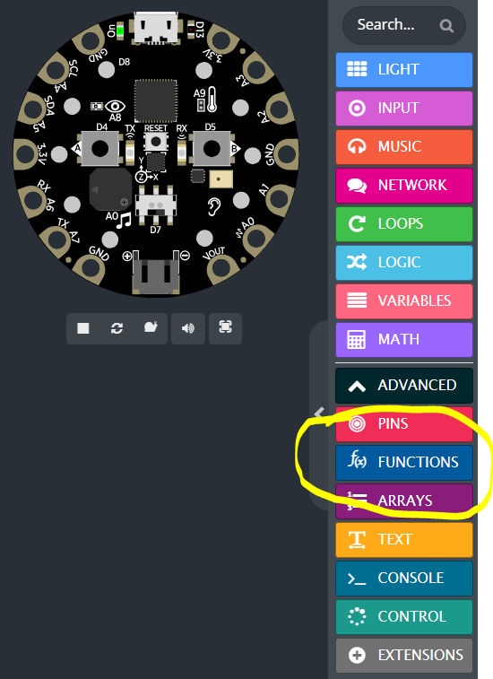
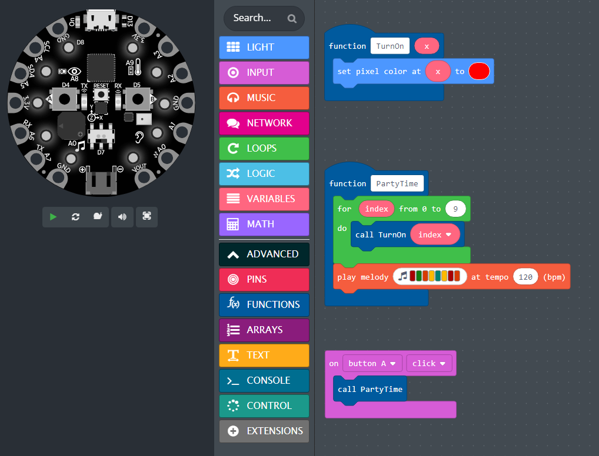

- **What are functions?**
  - Functions are fundamental building blocks of programs\.
  - They let you name a set of commands\.
  - Once defined\, a function can be re\-used over and over\.
- **Examples of functions:**
  - Add\( *x\, y* \)
    - Take two numbers  *x*  and  *y* \, and return the sum  *x\+y*
    - \(takes input and returns output\)
  - TurnOn\( *x* \)
    - Take a number between 0 and 9\, and turn on that LED
    - \(takes input\, does not return output\)
  - PartyTime\(\)
    - Set all pixels to red\, play a tune
    - \(doesn’t take input\, doesn’t return output\)

## Creating Functions

## Defining and Calling Functions

