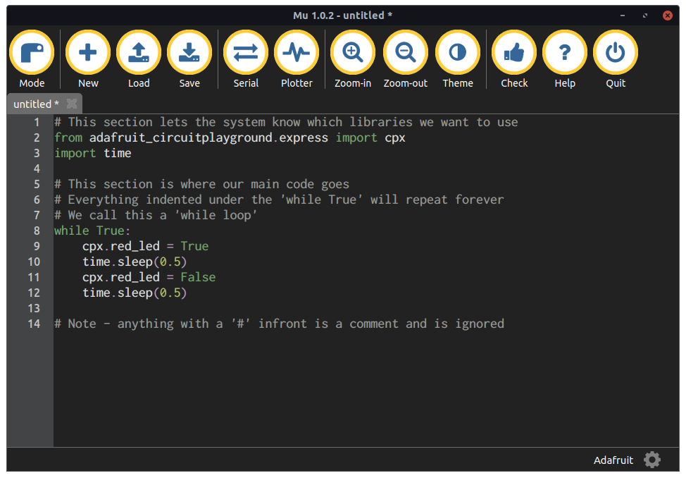

## Introduction à CircuitPython - Niveau 1

Ceci est l'atelier original d'une journée avec Circuit Playground Express et CircuitPython. Comprend une vue d'ensemble des capteurs et des lumières de la carte à travers le code. Permet aux étudiants d'explorer un aspect de l'appareil qu'ils apprécient pour un après-midi d'exploration.

[Aller aux exercices](/exercises/fr-CA/circuitpython/level-1/)

## Programmation avec CircuitPython - Niveau 2

Ce cours s'appuie sur l'atelier original d'une journée avec Circuit Playground Express et CircuitPython pour compléter la compréhension des concepts de programmation de base par les étudiants.

[Aller aux exercices](/exercises/fr-CA/circuitpython/level-2/)

## Programmation avec CircuitPython - Robotique - Version anglaise seulement

Ce cours s'appuie sur l'atelier original d'une journée avec Circuit Playground Express et CircuitPython pour compléter la compréhension des concepts de programmation de base par les étudiants.

[Aller aux exercices](/exercises/fr-CA/circuitpython/robotics/)
