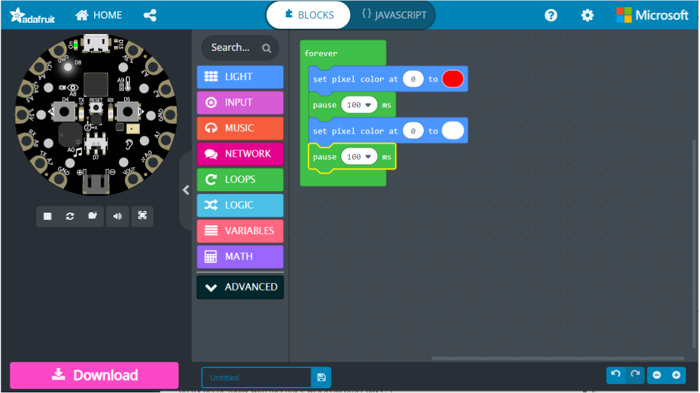

## Introduction à la programmation avec le Circuit Playground Express d'Adafruit et MakeCode

### Ouvrir l'environnement MakeCode

Avant de commencer, [allez sur le site MakeCode](https://makecode.adafruit.com) et sélectionnez le tutoriel "Nouveau ? Commencez ici".

La documentation est [ici](https://makecode.adafruit.com/docs) et si vous rencontrez des problèmes étranges, vous pourriez obtenir des [codes d'erreur](https://makecode.adafruit.com/device/error-codes).
