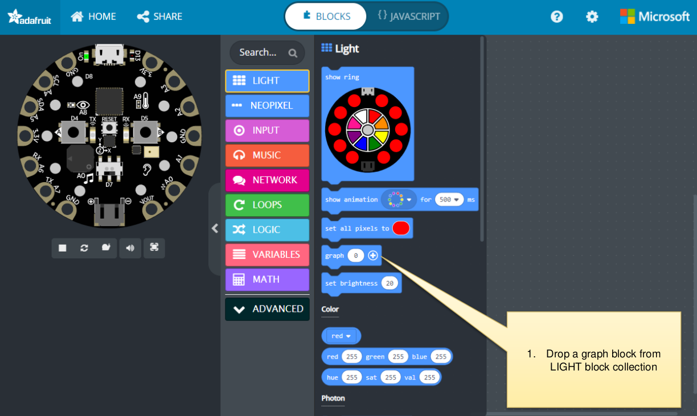
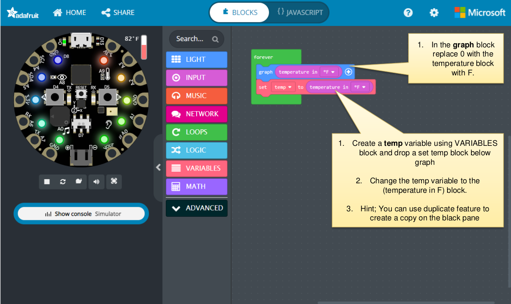
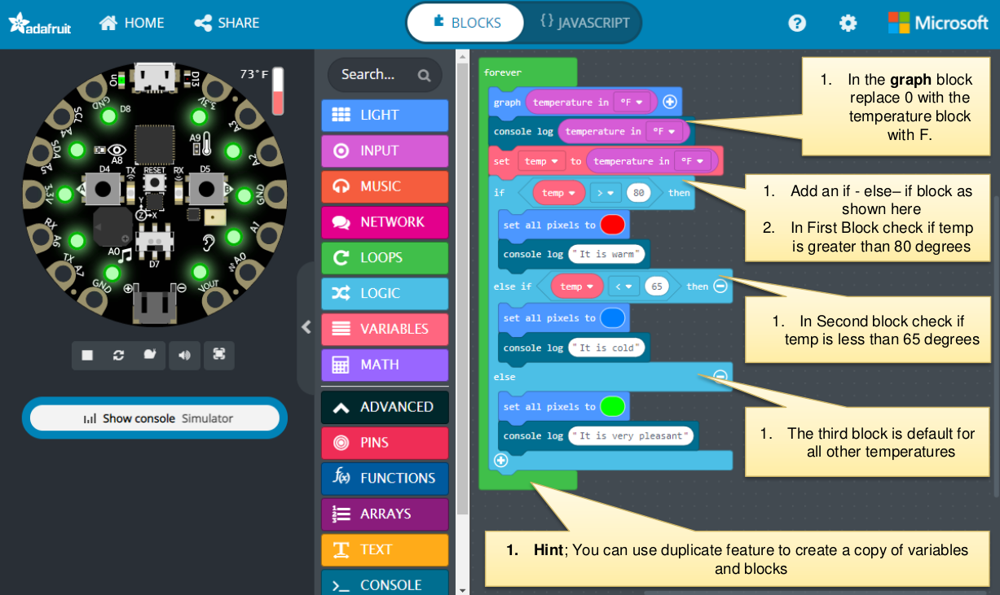
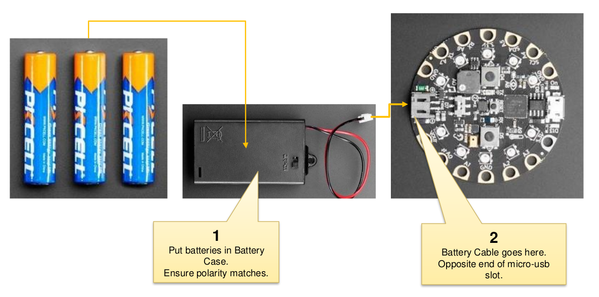

### Exercice 1 - Boucles

Qu'est-ce qu'une boucle dans la vie quotidienne ?
Quelque chose qui nécessite d'être fait continuellement pendant un certain temps ou indéfiniment.

Exemple de boucle de comptage : Se brosser les dents

brosser les dents en bas à gauche
brosser les dents en bas à droite
brosser les dents en haut à gauche
brosser les dents en haut à droite
Répétez les étapes ci-dessus 3 fois

Exemple de boucle conditionnelle : Fête dansante

Applaudir
Pas à gauche
Pas à droite
Répétez jusqu'à être fatigué

• Pouvez-vous donner un exemple de quelque chose qui nécessite d'être fait un certain nombre de fois ou continuellement dans la vie quotidienne ?

• Essayons un exercice pour allumer des anneaux en utilisant des boucles

### Exercice 2 - Exploration du Capteur de Température

Qu'est-ce qu'un capteur et où les voyez-vous dans la vie quotidienne ?

Les capteurs sont des dispositifs qui détectent quelque chose autour d'eux et nous permettent d'utiliser cette information pour faire quelque chose avec.

Par exemple :

- si le temps est chaud, alors allumez le ventilateur ou le climatiseur.
- si le temps est froid, alors allumez le chauffage.

Essayons un exercice pour allumer des anneaux en fonction de la température : chaud, froid ou confortable.

Maintenant, déconnectons l'appareil de l'ordinateur et promenons-nous pour voir les couleurs changer !

ATTENTION : NE METTEZ PAS l'appareil CPX dans l'EAU ou SUR LE FEU.

Projet : Devoirs pour allumer les pixels numérotés IMPAIRS et pairs en boucle continue en utilisant les blocs `for` ou `while`.

Devoir :

1. Allumez d'abord chaque LED néo-pixel numérotée IMPAIRE (1,3,5,7,9) en ROUGE.
2. Attendez 2 secondes,
3. Ensuite, allumez chaque LED numérotée PAIRE (2,4,6,8,10) en VERT.
4. Attendez 2 secondes
5. Continuez les étapes 1 à 4 en boucle continue.

Objectif : Explorer la prise de décision et les structures de boucles en utilisant le devoir ci-dessus.
