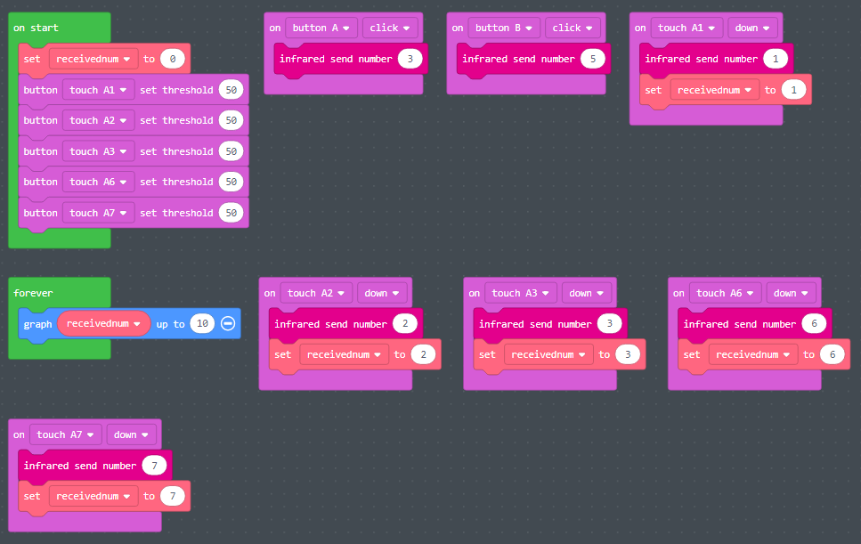

# IR Transmitter and Receiver

IR Transmitter and Receiver

- **What is infrared \(IR\)?**
  - Invisible to the naked eye
  - Used in wireless communications
  - Line\-of\-sight: transmitter must be pointed at the receiver
  - Short range: 10\-20 meters
- **Examples of consumer IR devices**
  - TV remote control
  - Video game controller
- **IR on the CPX**
  - CPX device has a transmitter and receiver
  - Setup 1: two CPX devices
    - One CPX sends a value and the other receives it
  - Setup 2: one CPX device and one mini\-remote control
    - Remote control sends a value and the CPX receives
    - This setup will be used for the final project

# Infrared in MakeCode

The simulator presents two CPX devices: one will act as the remote \(sender\) and the other will receive

Receiver uses logic block to take different actions based on the value transmitted

IR blocks available under **Network**

By default\, the received value is assigned to variable **num**

# Infrared Example # 1

- The function “on infrared received” corresponds to the receiver\.
- The function “infrared send number” corresponds to the transmitter
- We use the inputs to transmit different infrared numbers\.
- We need to build the logic inside the “on infrared received” function to perform different actions based on what number it receives

# Tips

- CPX receiver logic block can become quite large
  - _Tip: use functions to split up the code into smaller\, more manageable chunks_
- If both CPX devices are programmed the same\, then either can act as the sender or receiver
- With 2 buttons and 7 touch sensors\, the CPX device can be easily programmed to send 9 different values

# Infrared Exercise \#2 \(Laser Tag\)

