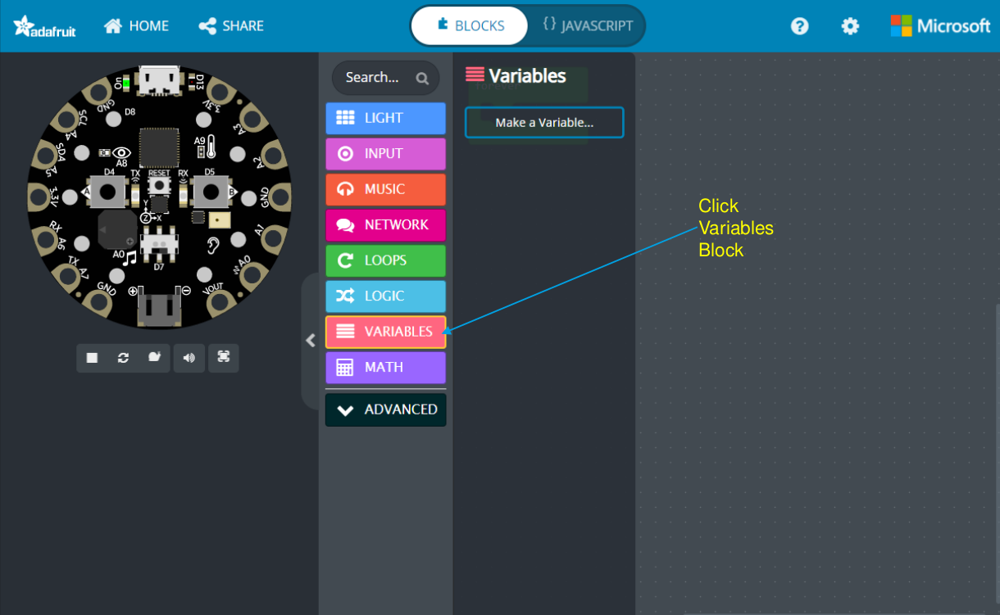
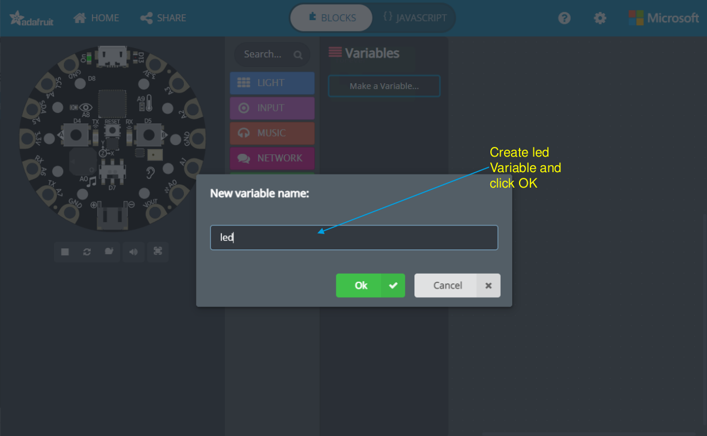
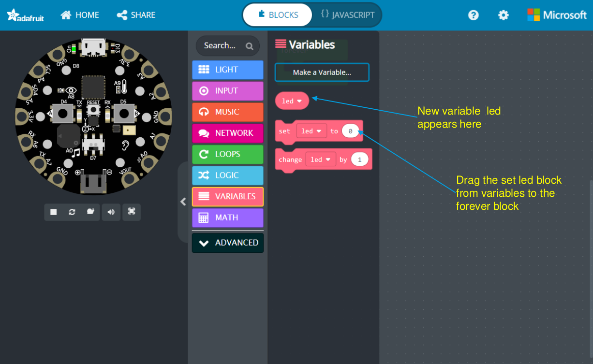
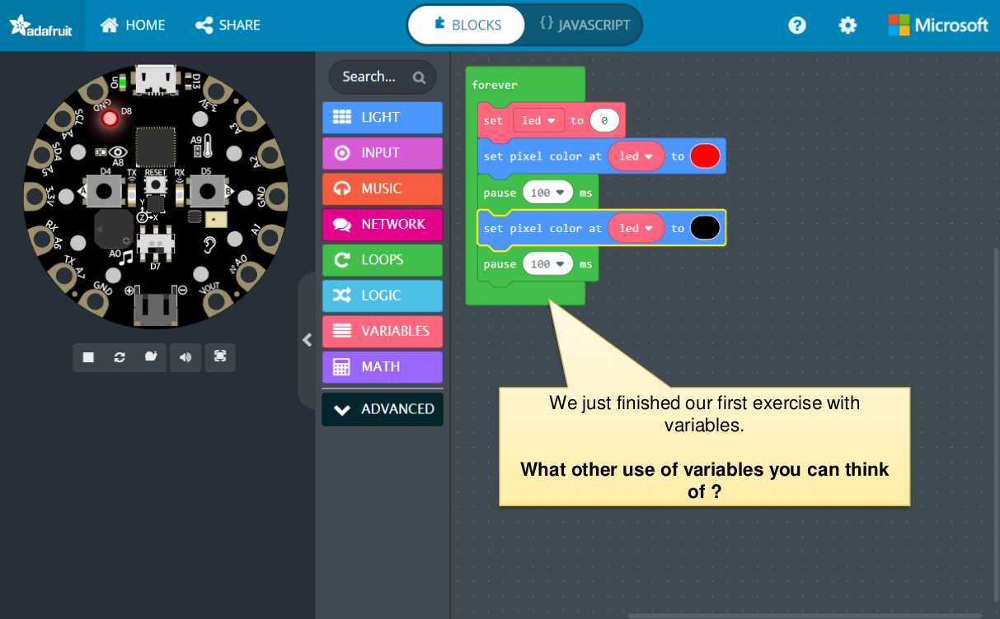

Read basics of MakeCode.
– Variables: https://makecode.adafruit.com/blocks/variables
– Logic: https://makecode.adafruit.com/blocks/logic
– Loops: https://makecode.adafruit.com/blocks/loops
– Basic Built In Objects:
• Math: https://makecode.adafruit.com/reference/math
• Test: https://makecode.adafruit.com/reference/text
• Arrays: https://makecode.adafruit.com/reference/arrays

Objective: Start using some of the features and code blocks to build our own functionality using CPX from next session.

What are variables in daily life?
Something that changes like the weather, the time, someone is standing or
sitting?
• Can you provide an example of what does not change?
• What do variables store?
Variable store information the time of the day, the light to turn on or off.
•
Lets try blinking random pixels in the next exercise

