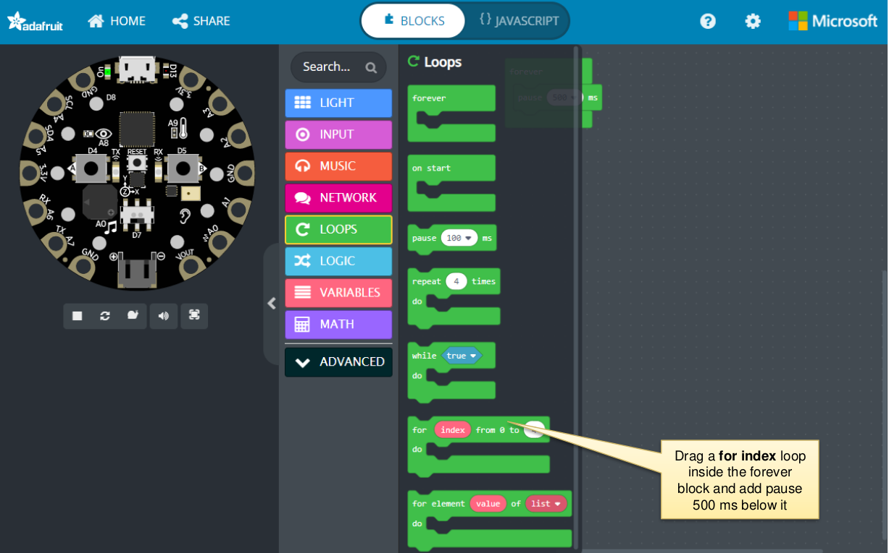
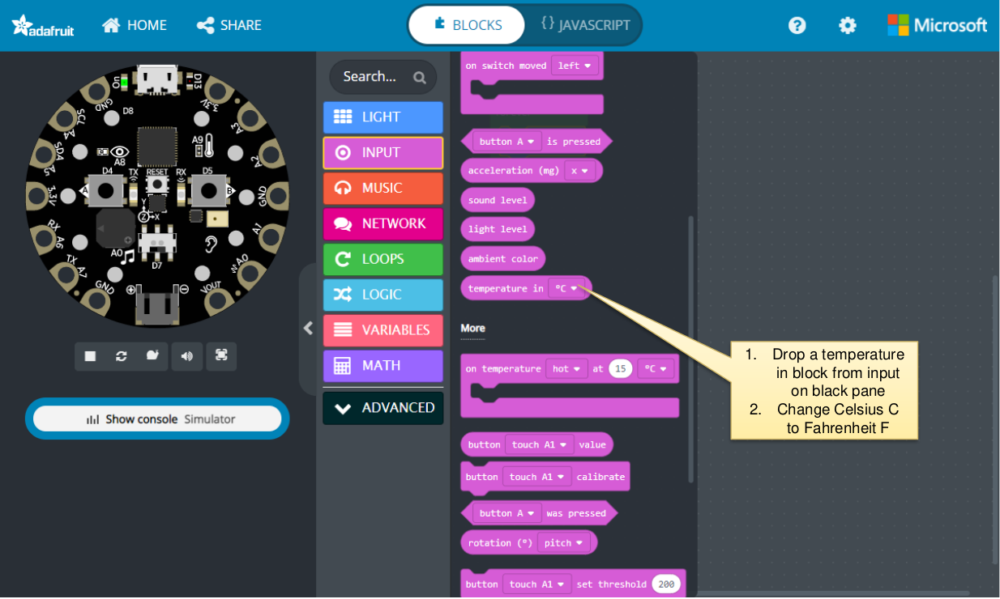

### Exercise 1 - Loops

What are Loops in daily life?
Something that requires doing continuously for certain of times or indefinitely.

Counting Loops example: Brushing your teeth

brush bottom left teeth
brush bottom right teeth
brush upper left teeth
brush upper right teeth
Repeat above 3 times

Conditional Loops example: Dance party

Clap
Step left
Step right
Repeat until tired

• Can you provide an example that requires doing certain number of times or
continuously in daily life that you use?

• Let’s try an exercise on lighting up rings using loops

### Exercise 2 - Exploring Temperature Sensor

What are sensors and where do you see them in daily life?

Sensors are devices that sense something around them and lets us use that information to do something with it.

For example:

- if the weather is warm, then turn on the FAN or Air Conditioner.
- if the weather is cold, then turn on the Heater

Let’s try an exercise on lighting up rings based on whether it HOT, COLD or comfortable.

Now, lets disconnect from the computer take it around to see the colors change!

WARNING: DO NOT PUT CPX device in WATER or OVER FIRE.

Project: Assignments for lighting up ODD numbered pixels and even numbers
pixels in a continuous loop using `for` or `while` blocks.

Assignment:

1. First Turn every ODD (1,3,5,7,9) numbered neo pixel led to RED.
2. Wait 2 seconds,
3. Then turn every EVEN (2,4,6,8,10) numbered led to GREEN.
4. Wait 2 seconds
5. Continue steps 1 thru 4 in a repeating loop.

Objective: Explore Decision Making and Loops Structures using above assignment
