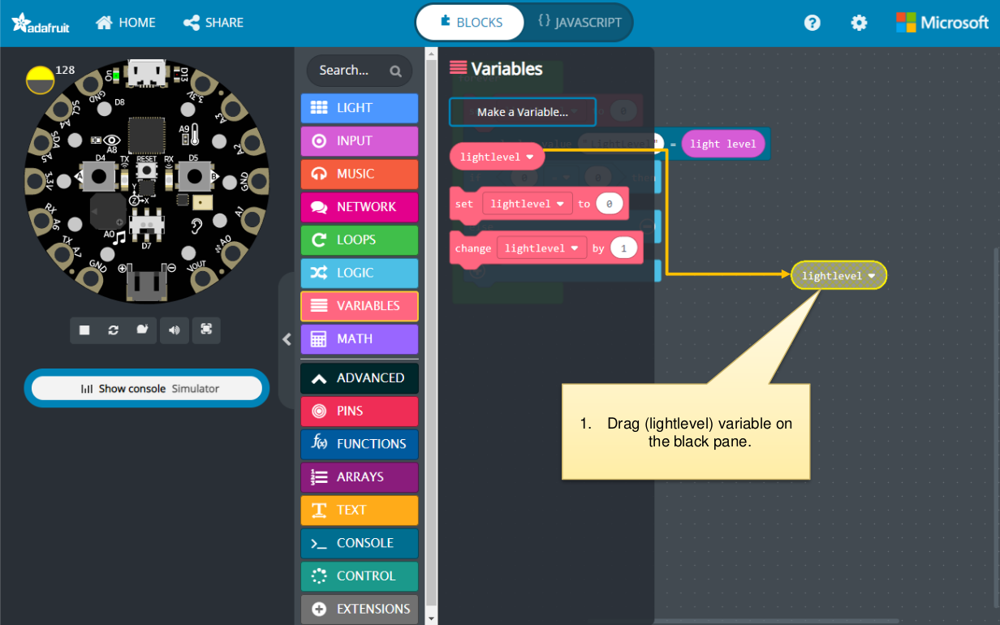
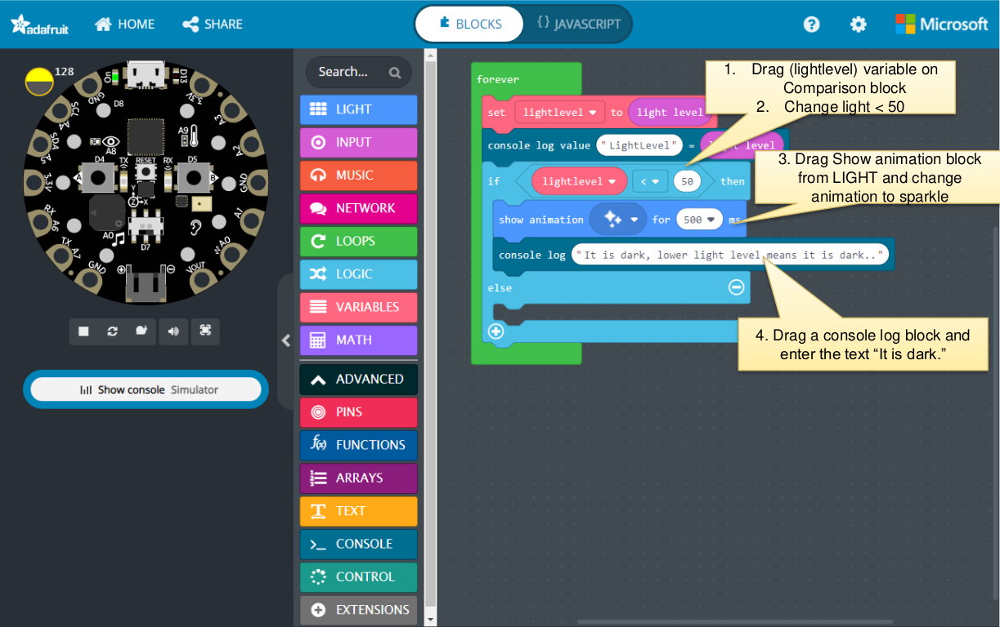
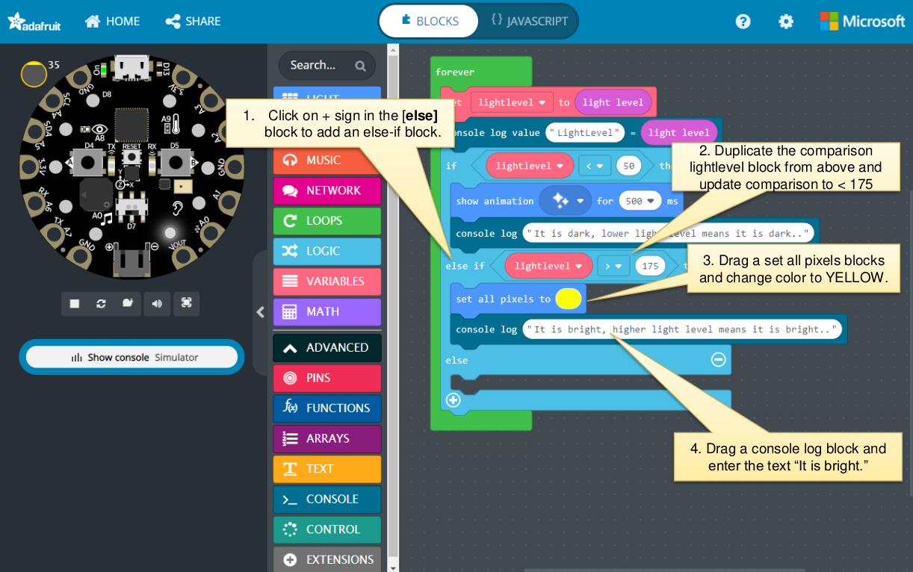
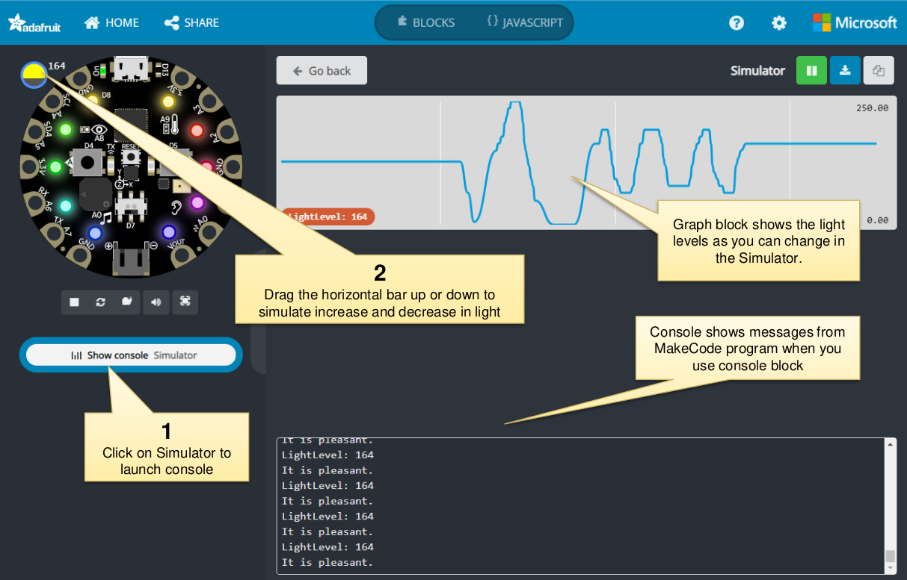
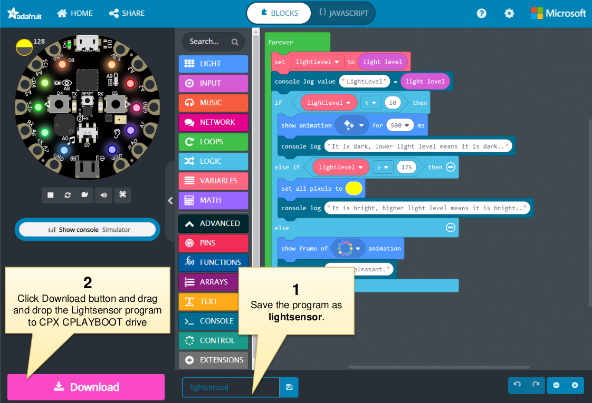

### Exercise 1 - What are light sensors?

Where do you see light sensors being used?

The input from light sensor can be used to do many things like turn on a light automatically or turn off a light.

Project: Sense the Light in the room and change the color of LED pixels based on the color of light.

A device that can sense the amount of light in a room.
Assignment:
 - If the light sensor reading is below 50 turn all neo pixels color to gray.
 - If light sensor readout is above 175 turn all neo pixels to yellow.
 - If light sensor readout is anything else all neo pixels to light blue.
Objective: Explore Light Sensor from the above assignment.

Try taking CPX in dark places like a closet.
• Try taking CPX in moderately lighted place like in a room with lights ON.
• Try taking CPX closer to a lamp where it is bright and see how pixels change colors.

• Modify the light sensor program to run only when Button A is clicked. Hint, use On
Button block from INPUT Blocks.
• Make the program run only once per click.
• Make the lights change color based on the light level WITHOUT using if-else-block
and color the pixels directly.