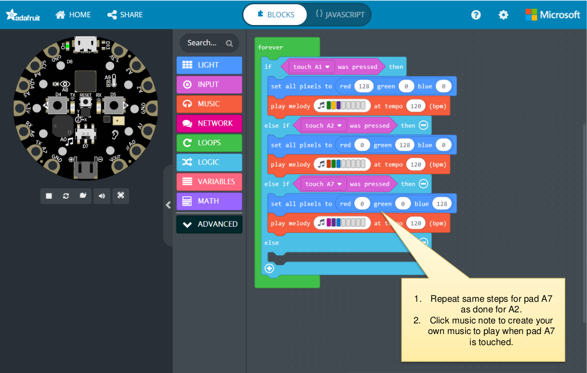
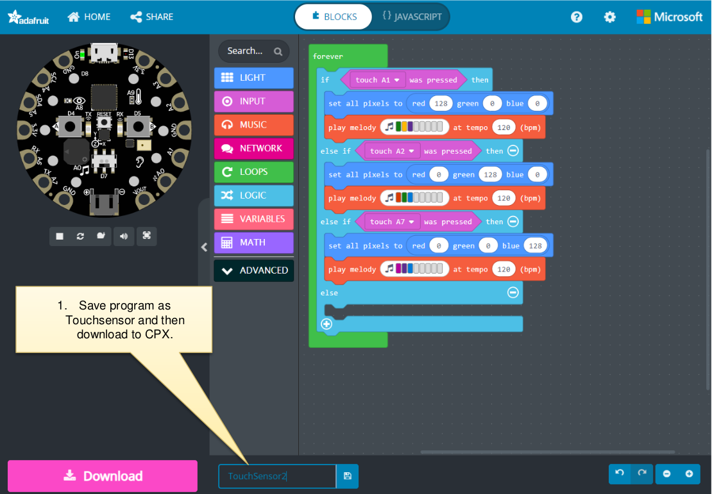

### Capacitive Touch Sensor

Project: Sense a touch on the capacitive input

Assignment: Play different music notes and color an LED corresponding to that key touched.

- Program touch pad A1 to play your own music note and turn all lights to RED
- Program touch pad A2 to play your own music note and turn all lights GREEN
- Program touch pad A7 to play your own music note and turn all lights BLUE

Objective: Explore Capacitive Touch sensor using the above assignment

CPX has 7 touch pads A1, A2, A3, A4, A5, A6, A7 that can sense a touch.
• One can use the touch pads to turn on lights, play music, turn another electronic
devices on/off.
• Touch pads can also sense how soft or hard the touch has been pressed.

Project: Sense a touch on the capacitive input

Additional Challenge: Change the color of all the LEDs based on the amount of pressure on a touch pad A1.

The harder the pressure change the color from Blue, Green to Red.
Objective: Explore Capacitive Touch sensor using the above assignment

