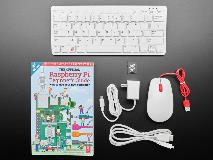
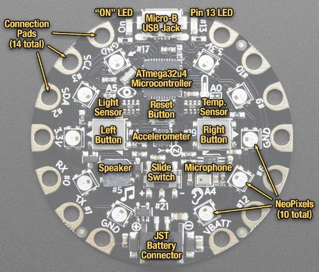
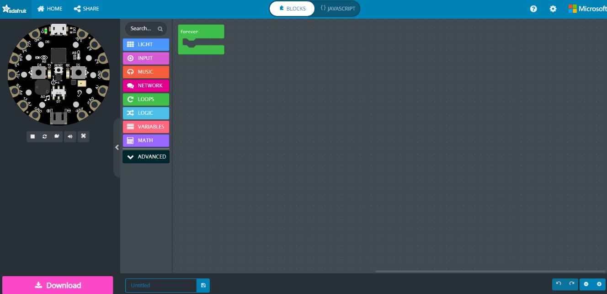
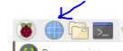
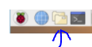

# MakeCode Robotics Overview

* Students will Learn:
  * __MakeCode__ : Learn to program CPX microchip using a "drag and drop" MakeCode interface
  * __Robotics__ : Introduction to robotics using CPX and Crickit microchips.
  * __Raspberry Pi Computer__ : Using this world\-famous Linux based Computer as your personal laptop

* Tools we'll use
  * Adafruit CircuitPlaygroundExpress
  * External Display & Raspberry Pi 400 Desktop Computer Kit
  * Crickit Motors and robot body

# Overview of CPX Features

* 10 Mini NeoPixel LEDs, each one can display any rainbow color
* Accelerometer with Tap and Free\-Fall Detection
* Temperature Sensor
* Light Sensor
* Sound Sensor
* Infrared Transmitter and Receiver
* Mini speaker
* 2 push buttons, left and right
* Slide Switch
* 7 pads can act as Capacitive Touch input and more...

# Overview of Adafruit Makecode Interface

https://makecode.adafruit.com/

# Device Setup

# Raspberry Pi Setup

* General Powerup\.
    * Connect Power cord\, USB Mouse\, Display with HDMI cable and additional micro\-to\-hdmi adapter\.
    * The Raspberry Pi will come on automatically upon power is connected\.
    * Please skip the operating system update\. This typically takes at least 30 minutes\.
    * Refer to this YouTube Video on how to connect everything:
      * [Connect Raspberry Pi to Portable Display](https://youtu.be/J42xo_hkbhM)
  * _Changing Wireless network and Verify Internet Connection_
    * Choose Wireless network by choosing WiFi icon on the top right\-hand corner\. Icon is next to Bluetooth icon\. 
    * Choose your WiFi network and enter network password if one is assigned for the network\.
    * Verify that Raspberry Pi is connected to WiFi and able to access Internet\.
    * Start Chromium internet browser from top left\-hand menu\. Icon look like a Globe with Blue color 
    * Enter any URL
  
# CPX Microchip Setup

* Connect CPX
    * Take the USB cable and connect it to the Raspberry Pi\.
    * Attach the CPX device to the other end of USB cable\.
    * Press the RESET button on the CPX device\. Reset button is the center of the CPX device and is small button\.
    * The device will light up all GREEN\.
    * Click Files icon from top left hand menu bar\. 
    * You should see CPLAYBOOT as one of the folders\.
* Start Chromium internet browser from top left hand menu\.
    * Type [https://makecode\.adafruit\.com](https://makecode.adafruit.com/) in the browser\.
* Start New Project By Clicking 
* Check YouTube Video on creating sample Makecode program and download to CPX: _[Sample program on Adafruit CPX using ](https://youtu.be/DtwpVIRUKzg)_  [Makecode](https://youtu.be/DtwpVIRUKzg)

# Quick Start Example - Red Light

_CPX Device_

_MakeCode_

# Setup Instructions - Download

Select Download \(pink button\)

Setup Instructions

Click and drag the file to CPLAYBOOT

