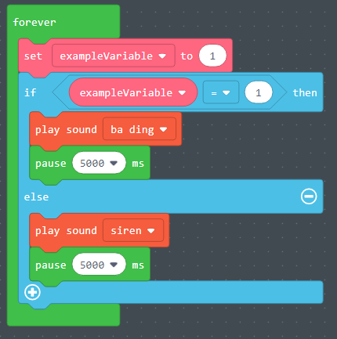

# Variables

* What is a variable?
  * A variable is used to store information inside a computer program.
  * These variables have descriptive names and can later be referenced within the program to retrieve the information they store.
* What are some examples of variables?
  * Weather = sunny
  * Light = red
  * The variable names weather and light reference the stored values.
* What are variables in daily life?
  * Something that changes like the weather, the time, someone is standing or sitting?
  * Volume on headphones

# Example (live intro by instructor)

[https://makecode.com/\_Jj17e3CiEetw](https://makecode.com/_Jj17e3CiEetw)

# Variables Example

* This is an example of how to create a variable called "exampleVariable" 
* Click on the variables tab and select "Make a variable"
* After that you can select to "set" the variable to a value. 
* Drag the exampleVariable onto the "set pixel color" function.

# Variables Exercise #1

* For this exercise attempt to make the led light at position "0" blink red continuously. 
* Use a forever loop to make the light blink forever. 
* Create a variable called "led" and set it to the value of "0". 
* Make the pixel color of "led" red 
* Make the program pause. 
* Next, make the pixel color of "led" black 
* Make the program pause again. 

# Variables Exercise #1 - Solution

# Variables Exercise #2

* In the previous exercise, we    made LED    light 0 blink. 
* For this exercise perform the following: 
* Use a forever loop to make all of the activity below happen forever 
* Attempt to make led light 0 blink red 
* Make a sound play on the CPX chip 
* Pause for 500    ms 
* Next make led light 1 blink 
* Pause for 500    ms 
* Make a sound play on the CPX chip 

# Variables Exercise #2 - Solution

# Logic Blocks

* What are logic blocks?
  * Logic blocks are essentially a block of code. The commands inside that block of code will only run under certain conditions.
* What are examples of logic blocks?
  * An example of a logic block would be an "If.....then" statement.
  * "If the weather is below 50 degrees then put on a jacket"
* What are logic in daily life? 
  * Something that requires making decisions.
  * IF the traffic light is GREEN, then go
  * ELSE IF the traffic light is YELLOW then slow down
  * ELSE stop

# Logic Block Example

* This is an example of a logic block. 
* In the example on the left the code inside the "else" statement will run because the condition of "does exampleVariable = 1" is not met.
* In the example on the right the code inside of the "if" statement is run because the value of "exampleVariable" does equal 1.

# Logic Block Exercise #1

* For this exercise we will set a value to a variable and then perform different actions in an "if...else" statement depending on the value of that variable.
  * Create a variable named "  lightonoff  ".
  * Set the "  lightonoff  " variable to the value "0"
  * Create an "if……else" statement
  * For the "If……else" statement set the criteria so that if the value of "  lightonoff  " is equal to "0" then  the pixel color at "0" will be black.
  * If the value of "  lightonoff  " does not equal "0" then make the led light 0 blink red and white.
  * In order to make the led light number 0 blink red/white you will need to set the pixel color to red, then pause, and then set it to white, and then pause.
* _Questions_:
  * Why does the program do nothing when we set the value of "  lightonoff  " to "0"?
  * What happens if you change the value of "  lightonoff  " to "1"? 

# Logic Blocks Exercise #1 - Solution

# Logic Block Exercise #2

* In the previous exercise, we had to change the value of the  "lightonoff" variable to turn on or turn off the light.  Extend the example to do the following: 
  * On click of Button A, turn on the light. 
  * On click of Button B, turn off the light. 
  * By doing this, you not have to change the value of the variable manually. 
  * Also, you will implement a functionality resembling a light switch in your home. 
* Button A and Button B can be located on the CPX device as  highlighted below: 

