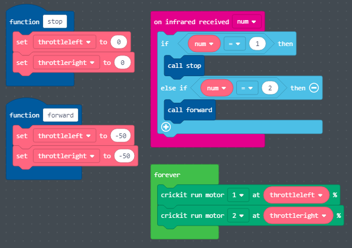

# What are Crickit microchips?

* Crickit microchips are used along with the CPX microchips because they can control more powerful motors that the CPX could not power by itself.
* They also have the capability of hooking up additional sensors to the Crickit

# Crickit Example

* In order to turn the motors on you need to call the function "crickit run motor” for both motors.
* We can run the motor at a percentage (number) that we set inside two variables called " throttleleft " and " throttleright ". 
* We can change the value for these variables at different points in the program based on if we want the robot to go forwards, backwards, left, or right

# Crickit Exercise #1

