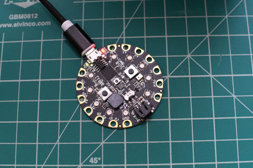

Todo o código do Circuit Playground segue um formato semelhante. Vamos começar com um pequeno exemplo.



```python
# Esta seção permite que o sistema saiba quais bibliotecas queremos usar
from adafruit_circuitplayground.express import cpx
import time

# Esta seção é onde nosso código principal vai
# Tudo o que estiver recuado sob 'while True' será repetido para sempre
# Chamamos isso de 'loop while'
while True:
    cpx.red_led = True
    time.sleep(0.5)
    cpx.red_led = False
    time.sleep(0.5)

# Nota - qualquer coisa com um '#' na frente é um comentário e é ignorado
```
