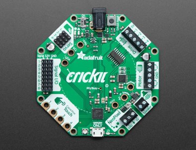
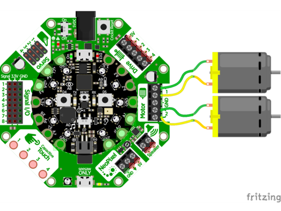
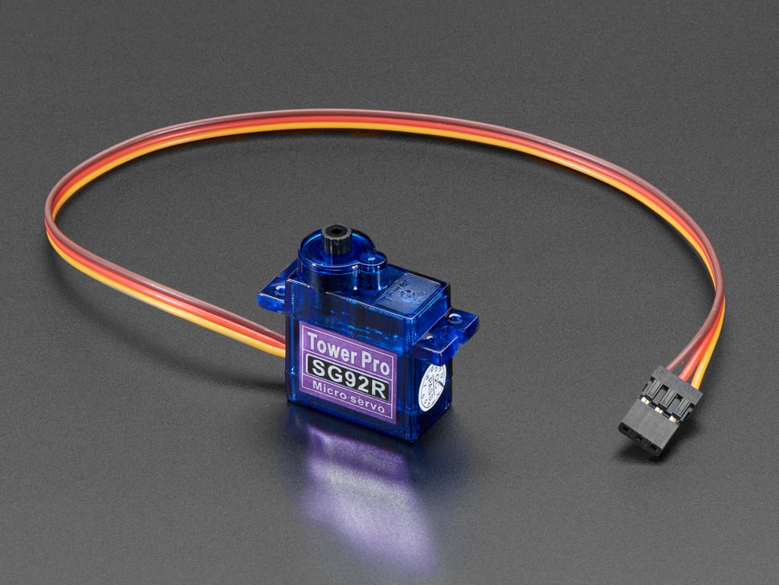
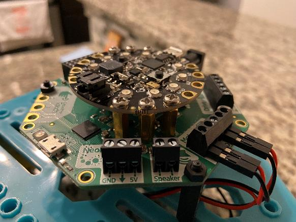

# O que é o CRICKIT?

- A placa CRICKIT pode ser usada em conjunto com uma placa Circuit Playground compatível (como CPX ou Bluefruit) para controlar motores mais potentes que a placa Circuit Playground não conseguiria alimentar sozinha.
- Ela também tem a capacidade de conectar sensores adicionais à CRICKIT





# Motores Servo

Servos são motores especializados que podem ser programados para se mover em incrementos precisos. O servo que usaremos possui um sinal de controle especial que instrui o motor a mover seu braço em um ângulo específico (entre 0 e 180 graus).



# Montagem

- Fixe a placa Circuit Playground ao CRICKIT

- Utilize os espaçadores de metal e parafusos (dentro da embalagem do CRICKIT)

- O micro USB na placa CP deve estar alinhado com a fonte de alimentação do CRICKIT



# Programação

Depois de conectar o cabo do servo ao Servo 1 no CRICKIT (fio amarelo voltado para fora), o seguinte programa pode ser executado para demonstrar toda a amplitude de movimento do braço do servomotor:

```python
from adafruit_crickit import crickit
import time

def move_and_sleep(angle):
    crickit.servo_1.angle = angle
    time.sleep(5)

while True:
    move_and_sleep(0)
    move_and_sleep(180)
```

Agora, vamos usar o telefone para mover o braço do servo gradualmente em toda a sua amplitude de movimento. Usaremos pacotes Bluetooth do tipo `ButtonPacket` para receber os pressionamentos dos botões Esquerdo e Direito no Control Pad do aplicativo. Usaremos uma [variável global](https://www.w3schools.com/python/python_variables_global.asp) que monitora o ângulo atual do braço do servo e implementaremos uma função `adjust_angle` que gira o braço na quantidade especificada:

```python
from adafruit_crickit import crickit

from adafruit_bluefruit_connect.packet import Packet
from adafruit_bluefruit_connect.button_packet import ButtonPacket

from adafruit_ble import BLERadio
from adafruit_ble.advertising.standard import ProvideServicesAdvertisement
from adafruit_ble.services.nordic import UARTService

ble = BLERadio()
uart_service = UARTService()
advertisement = ProvideServicesAdvertisement(uart_service)

# Comece com o braço na metade do caminho
angle = 90
crickit.servo_1.angle = angle

def adjust_angle(amount):
    global angle
    angle = angle + amount
    crickit.servo_1.angle = angle

while True:
    # Continue anunciando até que outro dispositivo se conecte
    ble.start_advertising(advertisement)
    while not ble.connected:
        pass
    ble.stop_advertising()

    # Continue ouvindo por pacotes enquanto estiver conectado
    while ble.connected:
        if uart_service.in_waiting:
            packet = Packet.from_stream(uart_service)
            if isinstance(packet, ButtonPacket):
                if packet.pressed:
                    if packet.button == ButtonPacket.LEFT:
                        adjust_angle(20)
                    elif packet.button == ButtonPacket.RIGHT:
                        adjust_angle(-20)
```

# Desafi

Se você testar o programa acima bastante, ele eventualmente travará com uma exceção `ValueError` (Dica: tente girá-lo além de sua amplitude total de movimento). Adicione dois blocos `if` à função `adjust_angle` que impedirão que o ângulo saia de sua amplitude válida.

# Referências

- [servo.angle](https://docs.circuitpython.org/projects/motor/en/latest/api.html#adafruit_motor.servo.Servo)

- [ButtonPacket](https://docs.circuitpython.org/projects/bluefruitconnect/en/latest/api.html#adafruit-bluefruit-connect-button-packet)

- [Python: global keyword](https://www.w3schools.com/python/gloss_python_global_keyword.asp)
