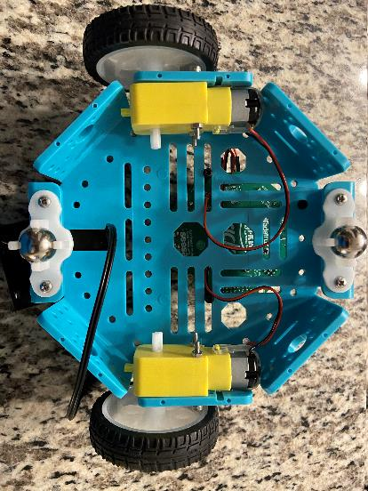

Na última lição, fixamos a placa Bluefruit ao Crickit. Agora vamos construir o resto do robô.

# Vídeo da montagem

[Assembly Walkthrough](https://video.morganstanley.com/#/videos/502f9fb8-00cc-4b84-950d-110df6d1edc4)

**Materiais necessários:**

- Bateria
- 3 pilhas AA
- Placa Bluefruit
- Crickit
- 2 Motores
- 2 Rodas
- Chassi do Robô
- 4 Parafusos M3 Longos + Porcas
- 4 Parafusos M3 Curtos + Porcas
- 3 Espaçadores, Parafusos e Porcas de Nylon Preto

# Prenda os motores

- Fixe um motor em cada lado
- Use parafusos M3 x 30 mm e porcas M3 \(Caixa pequena\)\.
- Passe os fios do motor pelo chassi
- Fixe as rodas giratórias
- Fixe as rodas giratórias em cada lado
- Use parafusos M3 x 16 mm e porcas M3 \(Caixa grande\).

# Fixe Bluefruit / Crickit ao corpo do robô

- Espaçadores de nylon macho para fêmea \(M3 x 20 mm\)
- Parafusos de nylon \(M3 x 12 mm\)
- Porcas de nylon \(M3\)

# Conecte os fios do motor e a fonte de alimentação

- Conecte os fios do motor e a fonte de alimentação ao Crickit
- Parafuse os fios do motor nas portas.
- Preto, Vermelho, Preto, Vermelho
- Passe a fonte de alimentação por baixo do corpo e até a porta de alimentação.

