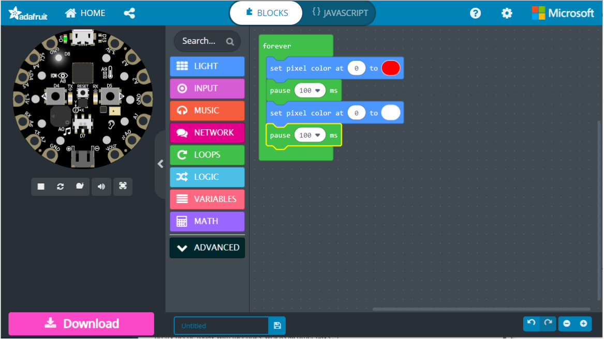

Tecnicamente, o projeto Blinky que criamos com o CircuitPython não faz exatamente a mesma coisa que o que criamos anteriormente com o Makecode:



Lembre-se de que nosso código Python utilizou a propriedade `cp.red_led`, que ativa ou desativa o pequeno LED vermelho D13. Para acender qualquer um dos 10 pixels maiores do dispositivo, usamos a propriedade `cp.pixels`:

```python
from adafruit_circuitplayground import cp

cp.pixels.brightness = 0.3
cp.pixels.fill((0, 0, 0))

while True:

    # observe como essas linhas são semelhantes
    cp.pixels[0] = (255, 0, 0)
    cp.pixels[1] = (255, 127, 0)
    cp.pixels[2] = (0, 255, 0)
    cp.pixels[3] = (0, 255, 127)
    cp.pixels[4] = (75, 0, 130)
    cp.pixels[5] = (60, 0, 255)
    cp.pixels[6] = (255, 255, 255)
    cp.pixels[7] = (0, 100, 0)
    cp.pixels[8] = (100, 0, 0)
    cp.pixels[9] = (0, 0, 100)

    # O [] com um número determina qual luz acender 
    # e os números entre () determinam a cor! 
    # Ele diz o quanto (vermelho, verde, azul) queremos. 
    # Tente mudar os números!
```

### Desafio

Altere o código do Blinky do Exercício 1 para usar o LED 0 em vez do D13. Tente fazer com que ele pisque em amarelo em vez de vermelho.

### Referências

- [cp.pixels](https://docs.circuitpython.org/projects/circuitplayground/en/latest/api.html#adafruit_circuitplayground.circuit_playground_base.CircuitPlaygroundBase.pixels)

- [Valores de cores RGB](https://www.w3schools.com/colors/colors_rgb.asp)
