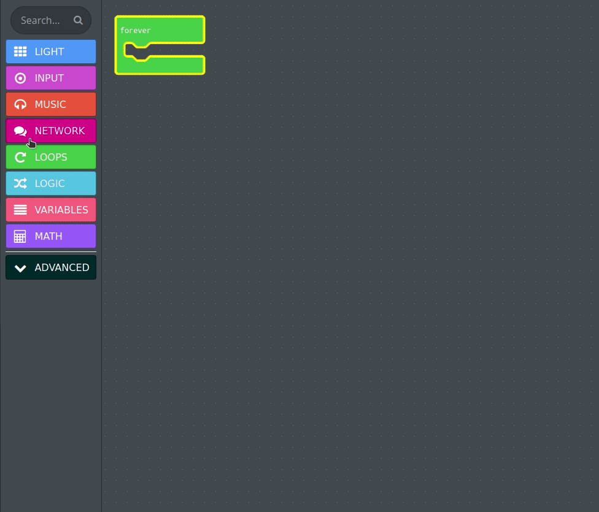
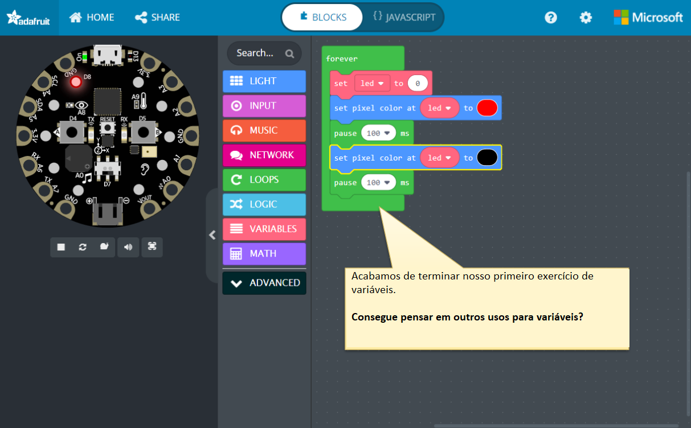
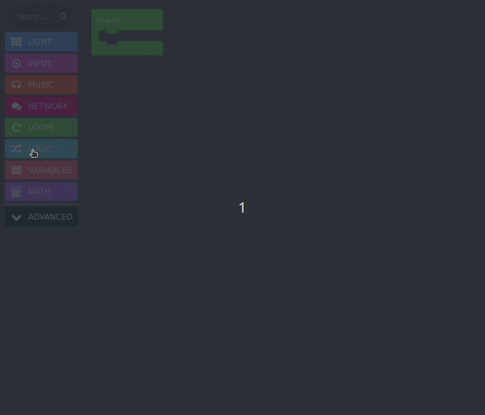
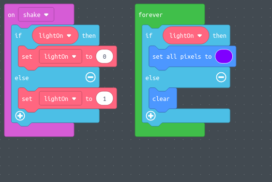

Leia o básico de MakeCode.

- [Variáveis](https://makecode.adafruit.com/blocks/variables)
- [Lógica](https://makecode.adafruit.com/blocks/logic)
- [Loops](https://makecode.adafruit.com/blocks/loops)
- Objetos básicos incorporados:
  - [Matemática](https://makecode.adafruit.com/reference/math)
  - [Texto](https://makecode.adafruit.com/reference/text)
  - [Matrizes](https://makecode.adafruit.com/reference/arrays)

Objetivo: Começar a usar alguns dos recursos e blocos de código para construir sua própria funcionalidade usando o CPX a partir da próxima sessão.

O que são variáveis ​​na vida cotidiana?

Algo que muda, como o clima, a hora, alguém em pé ou sentado?

- Você pode dar um exemplo do que não muda?
- O que as variáveis ​​armazenam?

Vamos tentar piscar pixels aleatórios no próximo exercício.

