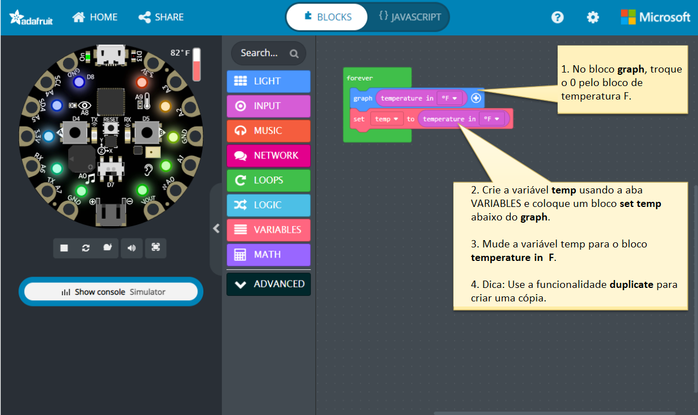

### Exercício 1 - Loops

O que são Loops, ou ciclos, na vida cotidiana?
Algo que requer execução contínua por um determinado período de tempo ou indefinidamente.

Exemplo de Loops de Contagem: Escovar os dentes

escovar os dentes inferiores esquerdos\
escovar os dentes inferiores direitos\
escovar os dentes superiores esquerdos\
escovar os dentes superiores direitos\
Repita 3 vezes

Exemplo de Loops Condicionais: Dança

Palmas\
Passo para a esquerda\
Passo para a direita\
Repita até cansar

• Você pode dar um exemplo de algo que exija ser executado um determinado número de vezes ou
continuamente na vida cotidiana que você usa?

• Vamos tentar um exercício sobre acender anéis usando loops

### Exercício 2 - Explorando o sensor de temperatura

O que são sensores e onde você os vê no dia a dia?

Sensores são dispositivos que detectam algo ao seu redor e nos permitem usar essa informação para fazer algo.

Por exemplo:

- se o tempo estiver quente, ligue o VENTILADOR ou o Ar-Condicionado.
- se o tempo estiver frio, ligue o Aquecedor.

Vamos fazer um exercício sobre acender anéis com base no fato de estar QUENTE, FRIO ou confortável.

Agora, vamos desconectar do computador e dar uma volta para ver as cores mudarem!

AVISO: NÃO COLOQUE O dispositivo CPX NA ÁGUA ou NO FOGO.

Projeto: Tarefa para iluminar pixels de números ÍMPARES e pixels de números pares em um loop contínuo usando blocos `for` ou `while`.

Tarefa:

1. Primeiro, acenda todos os leds numerados ÍMPARES (1, 3, 5, 7 e 9) em VERMELHO.
2. Aguarde 2 segundos.
3. Em seguida, acenda todos os leds de números PARES (2, 4, 6, 8 e 10) em VERDE.
4. Aguarde 2 segundos.
5. Continue as etapas de 1 a 4 em um loop repetitivo.

Objetivo: Explorar a Tomada de Decisão e as Estruturas de Loop usando a tarefa acima.