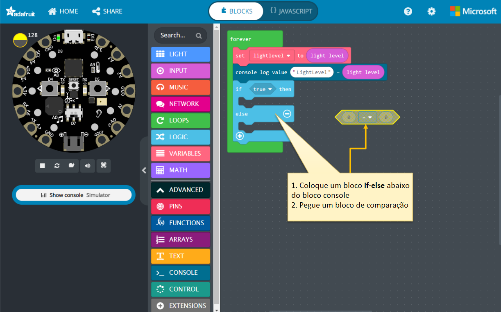

### O que são sensores de luz?

Onde você vê sensores de luz sendo usados?

A entrada do sensor de luz pode ser usada para muitas coisas, como acender ou apagar uma luz automaticamente.

Projeto: Detectar a luz no ambiente e alterar a cor dos pixels de LED com base na cor da luz.

Um dispositivo que detecta a quantidade de luz em um ambiente.
Tarefa:

- Se a leitura do sensor de luz for inferior a 50, acender todos os neopixels em cinza.
- Se a leitura do sensor de luz for superior a 175, acender todos os neopixels em amarelo.
- Se a leitura do sensor de luz for qualquer outro valor, acender todos os neopixels em azul claro.
Objetivo: Explorar o Sensor de Luz da tarefa acima.

Experimente levar a CPX em:

- locais escuros, como um armário.
- locais moderadamente iluminados, como um cômodo com luzes acesas.
- mais perto de uma luminária, onde haja luz, e observe como os pixels mudam de cor.

Indo além: modifique o programa do sensor de luz para que ele seja executado somente quando o Botão A for clicado. Dica: use o bloco "On Button" dos Blocos de ENTRADA.

- faça o programa ser executado apenas uma vez por clique.
- faça as luzes mudarem de cor com base no nível de iluminação SEM usar o bloco if-else e colorir os pixels diretamente.