### Sensor de toque capacitivo

Projeto: Detectar um toque na entrada capacitiva

Tarefa: Tocar diferentes notas musicais e colorir um LED correspondente à tecla tocada.

- Programar o touchpad A1 para tocar sua própria nota musical e acender todas as luzes na cor VERMELHA.
- Programar o touchpad A2 para tocar sua própria nota musical e acender todas as luzes na cor VERDE.
- Programar o touchpad A7 para tocar sua própria nota musical e acender todas as luzes na cor AZUL.

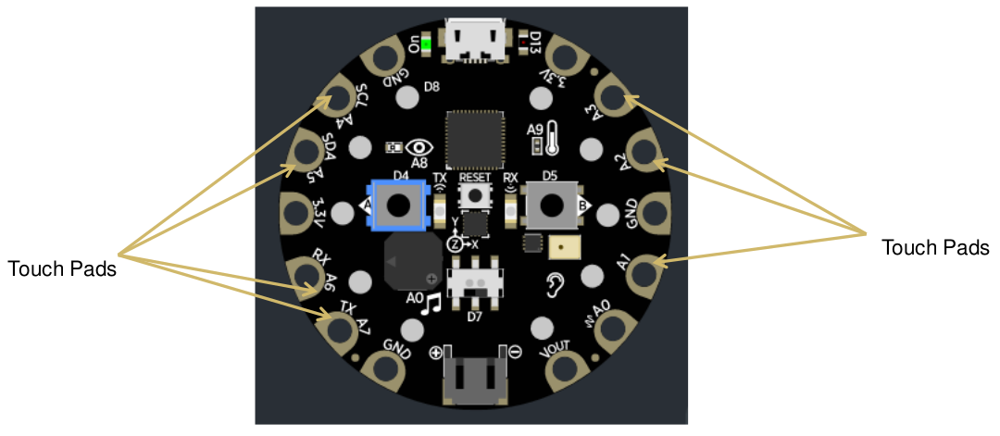

Objetivo: Explorar o sensor de toque capacitivo usando a tarefa acima.

O CPX possui 7 touchpads A1, A2, A3, A4, A5, A6 e A7 que podem detectar um toque.\
• É possível usar os touchpads para acender luzes, tocar música e ligar/desligar outros dispositivos eletrônicos.\
• Os touchpads também podem detectar a suavidade ou a força do toque.

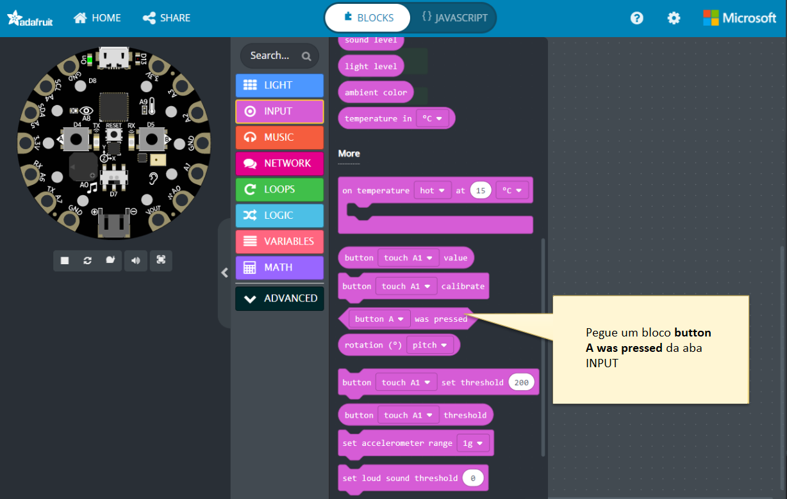
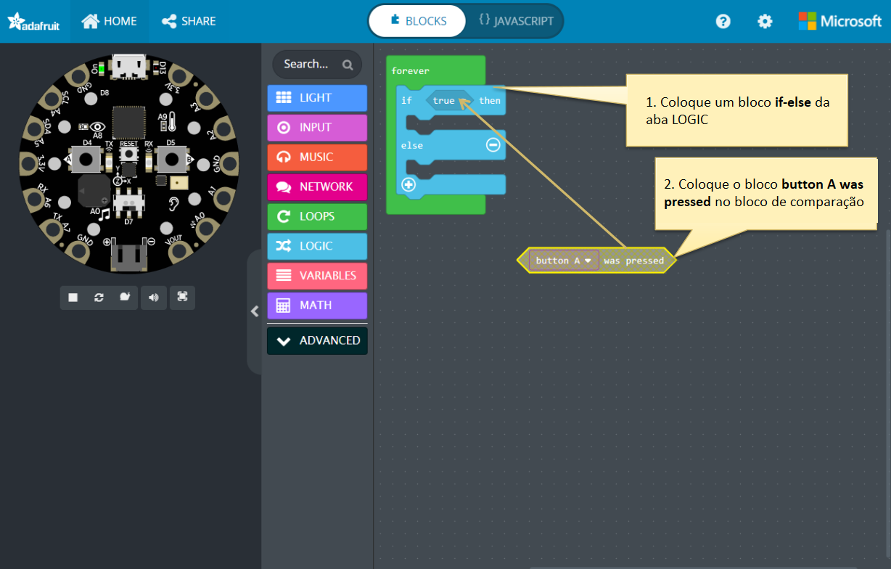
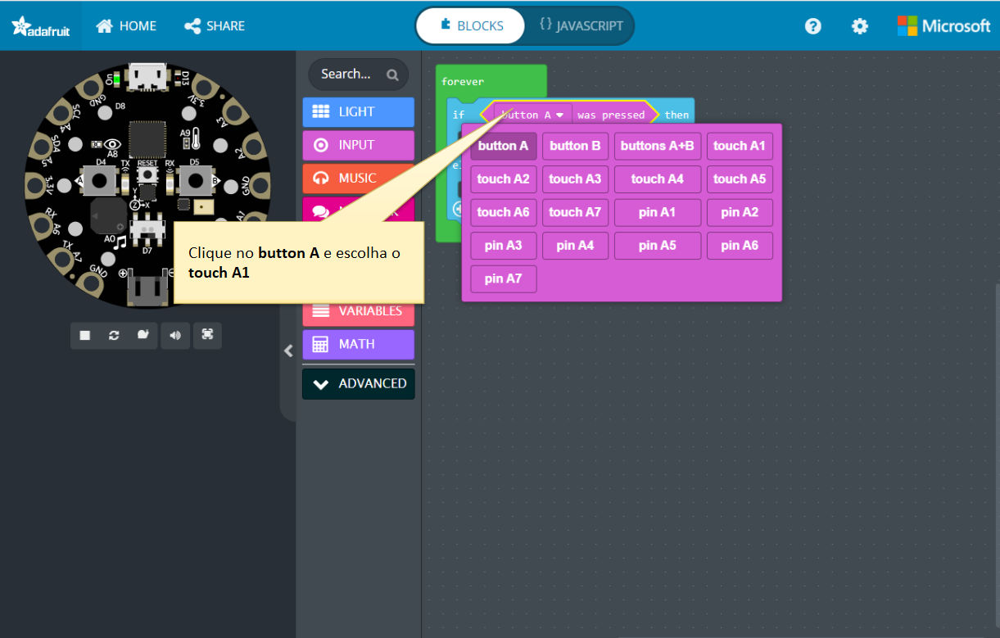
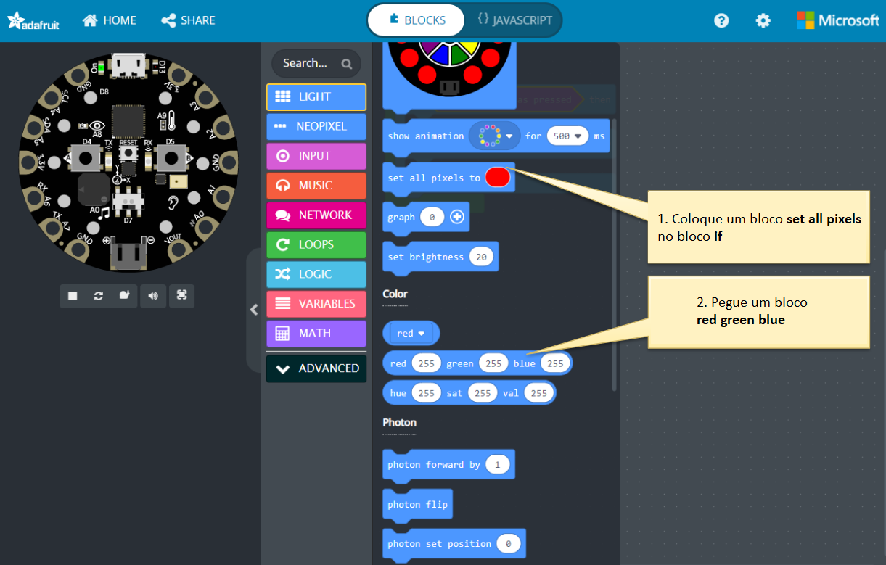
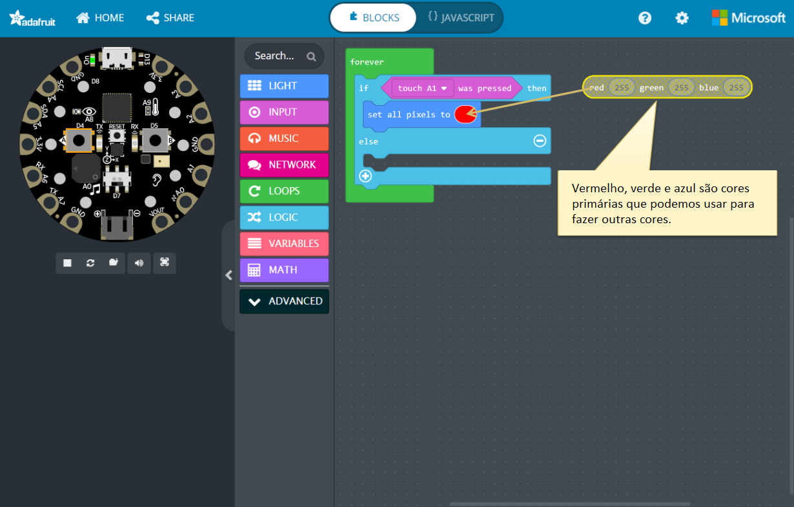
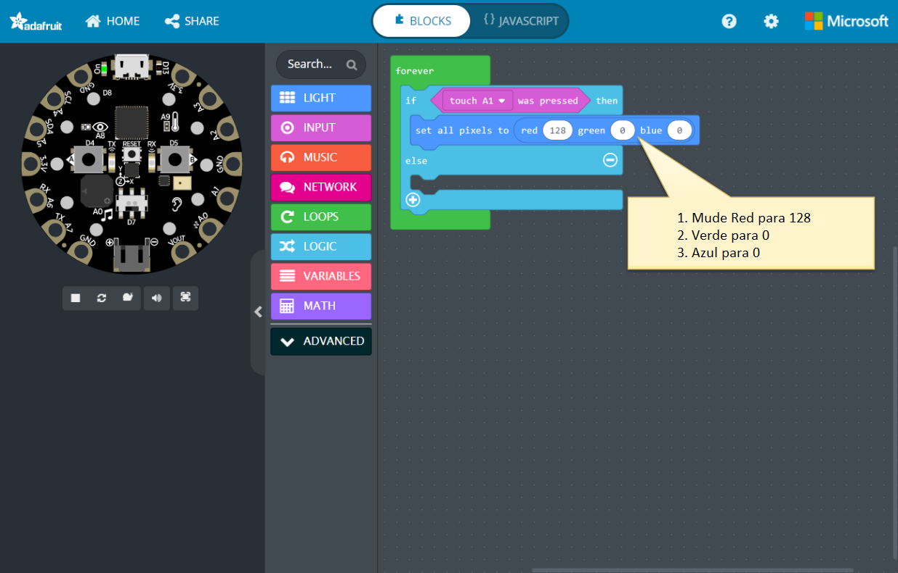
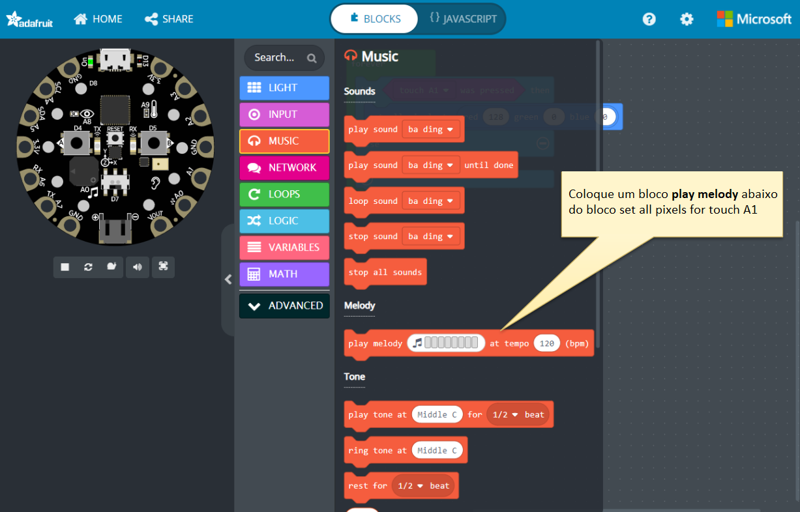
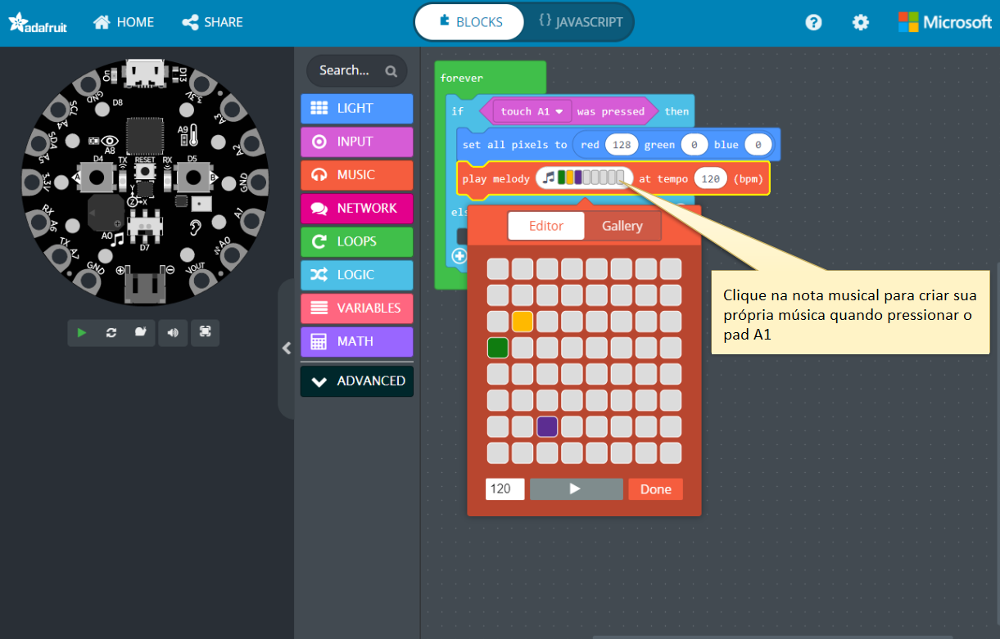
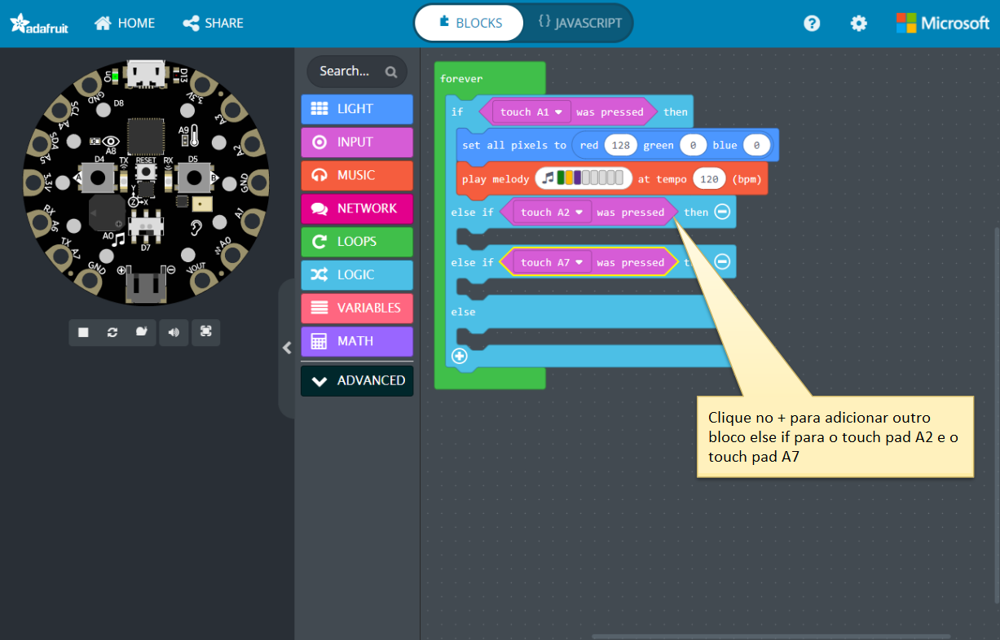
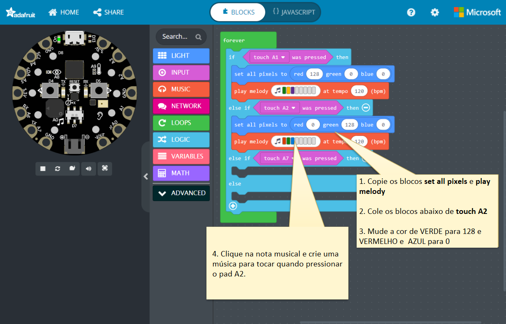
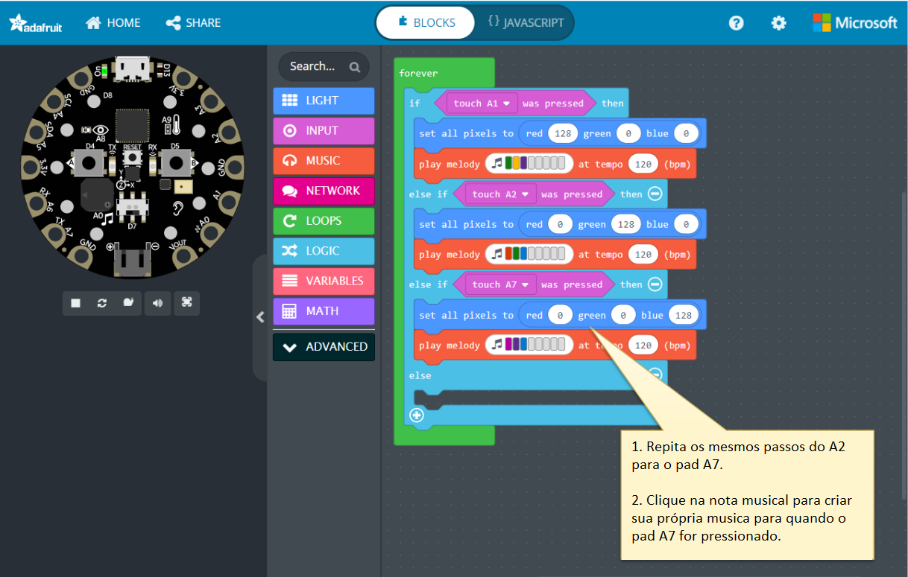
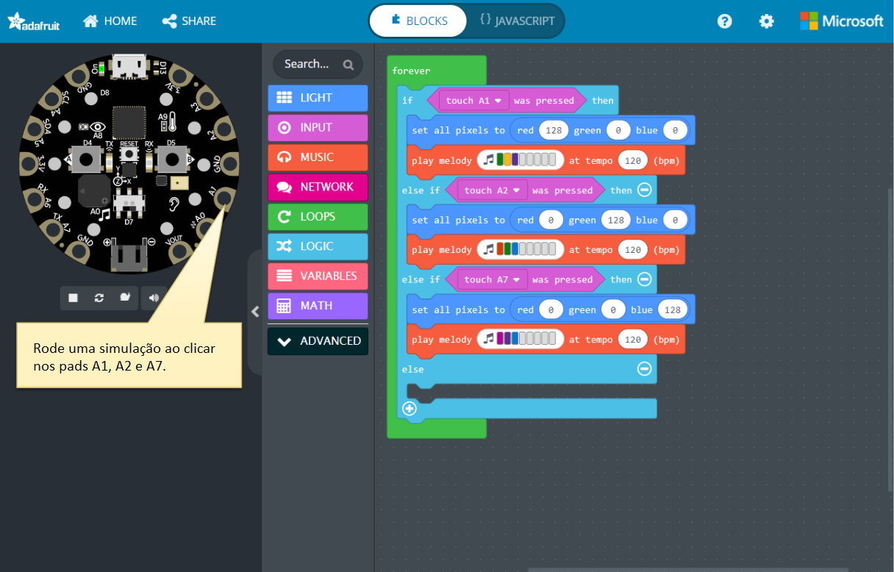
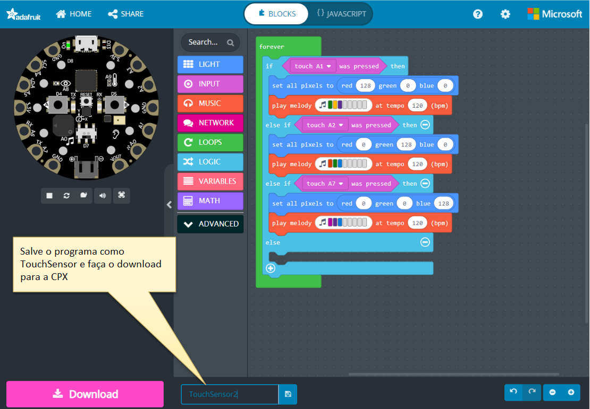

Projeto: Detectar um toque na entrada capacitiva

Desafio adicional: Alterar a cor de todos os LEDs com base na quantidade de pressão exercida sobre o touchpad A1.

Quanto mais forte a pressão, a cor muda de Azul, Verde para Vermelho.

Objetivo: Explorar o sensor de toque capacitivo usando a tarefa acima.

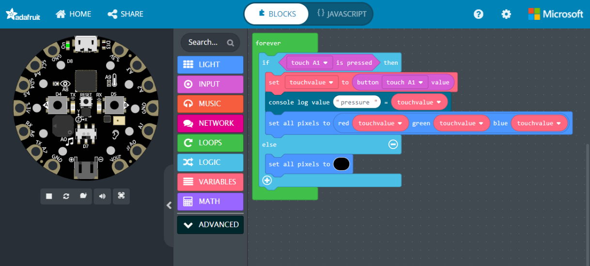
