# Visão geral da robótica MakeCode

- Alunos vão aprender:

  - **MakeCode**: Aprenda a programar um microchip CPX usando uma interface MakeCode de "arrastar e soltar"
  - **Robótica**: Introdução à robótica usando microchips CPX e Crickit.
  - **Computador Raspberry Pi**: Usando este mundialmente famoso computador baseado em Linux como seu laptop pessoal

- Ferramentas que usaremos
  - Adafruit CircuitPlaygroundExpress
  - Kit de monitor externo e Raspberry Pi 400 Desktop Computer Kit
  - Motores Crickit e corpo do robô

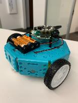

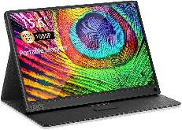

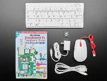

# Visão geral dos recursos do CPX

- 10 Mini LEDs NeoPixel, cada um exibindo qualquer cor do arco-íris
- Acelerômetro com detecção de toque e queda livre
- Sensor de temperatura
- Sensor de luz
- Sensor de som
- Transmissor e receptor infravermelho
- Mini alto-falante
- 2 botões de pressão, esquerdo e direito
- Interruptor deslizante
- 7 pads podem atuar como entrada de toque capacitiva e muito mais...

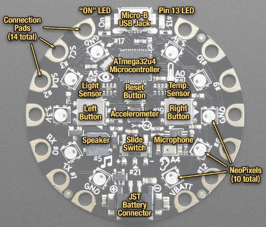

# Visão geral da interface Makecode do Adafruit

https://makecode.adafruit.com/

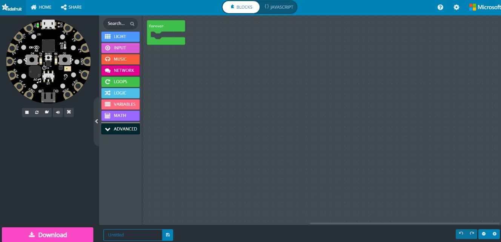

# Configuração do dispositivo

# Configuração do Raspberry Pi

- Powerup geral\.
  - Conecte o cabo de alimentação\, o mouse USB\, o monitor com o cabo HDMI e o adaptador micro para HDMI adicional\.
  - O Raspberry Pi ligará automaticamente ao conectar a energia\.
  - Ignore a atualização do sistema operacional\. Isso normalmente leva pelo menos 30 minutos\.
  - Veja este vídeo do YouTube sobre como conectar tudo:
    - [Connect Raspberry Pi to Portable Display](https://youtu.be/J42xo_hkbhM)
  - _Alterando a rede sem fio e verificando a conexão com a Internet_
    - Selecione a rede sem fio selecionando o ícone WiFi no canto superior direito\. O ícone está ao lado do ícone Bluetooth\. 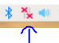
    - Selecione sua rede WiFi e digite a senha da rede, se houver\.
    - Verifique se o Raspberry Pi está conectado ao WiFi e consegue acessar a internet\.
    - Abra o navegador Chromium no menu superior esquerdo\. O ícone se parece com um globo azul. 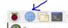
    - Digite qualquer URL.

# Configuração do CPX Microchip

- Connecte o CPX
  - Pegue o cabo USB e conecte-o ao Raspberry Pi\.
  - Conecte o dispositivo CPX à outra extremidade do cabo USB\.
  - Pressione o botão RESET no dispositivo CPX\. O botão RESET está localizado no centro do dispositivo CPX e é um botão pequeno\.
  - O dispositivo ficará VERDE\.
  - Clique no ícone Arquivos na barra de menu superior esquerda\. 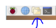
  - Você deverá ver CPLAYBOOT como uma das pastas\.
  - Abra o navegador Chromium no menu superior esquerdo\.
  - Digite [https://makecode.adafruit.com](https://makecode.adafruit.com/) no navegador\.
- Inicie um novo projeto clicando em 
- Assista ao vídeo do YouTube sobre como criar um programa de exemplo do Makecode e baixe-o para o CPX: _[Sample program on Adafruit CPX using ](https://youtu.be/DtwpVIRUKzg)_ [Makecode](https://youtu.be/DtwpVIRUKzg)

# Exemplo de início rápido - Luz vermelha

_CPX Device_

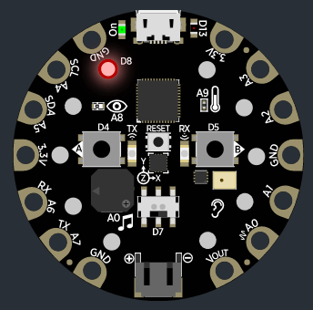

_MakeCode_

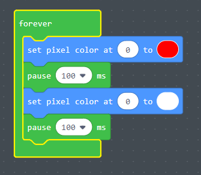

# Instruções de configuração - Download

Selecione Download \(botão rosa\)

Instruções de configuração

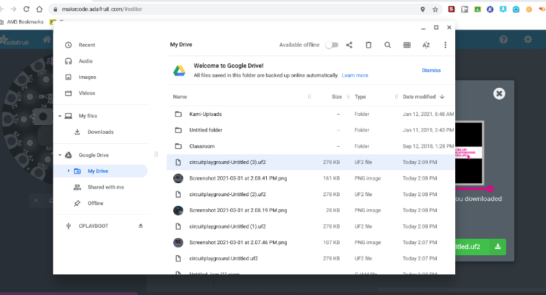

Clique e arraste o arquivo para CPLAYBOOT
