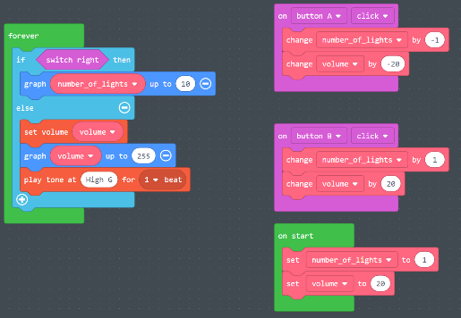
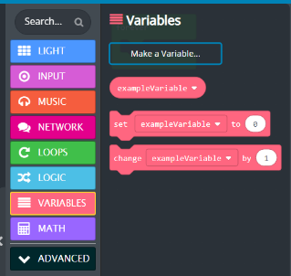
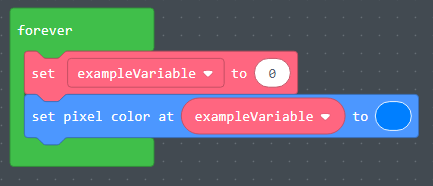
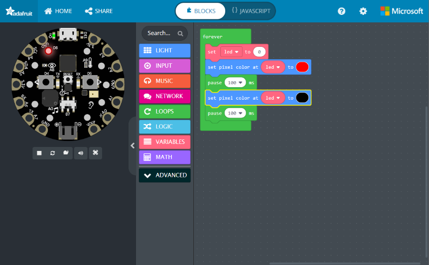
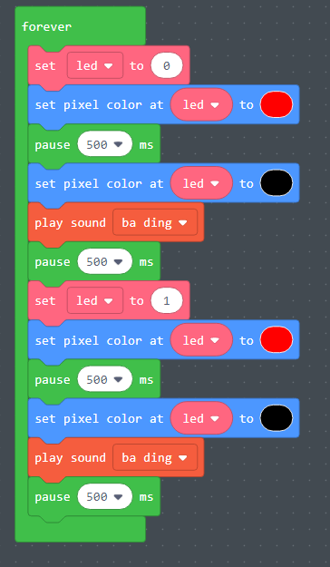
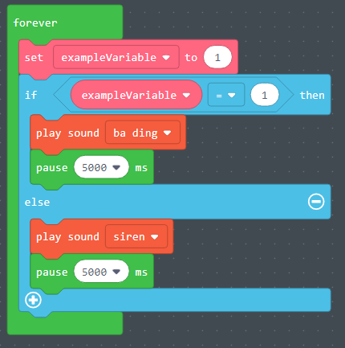
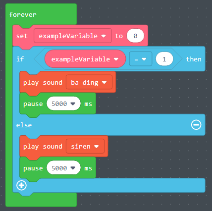
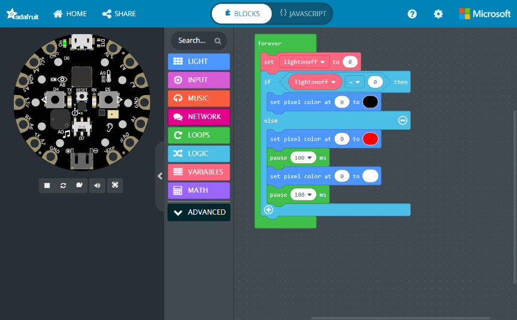
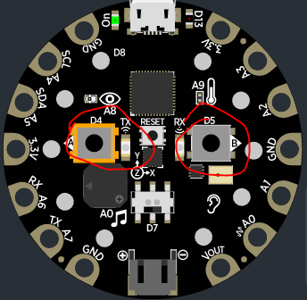

# Variáveis

- O que é uma variável?
  - Uma variável é usada para armazenar informações dentro de um programa de computador.
  - Essas variáveis ​​têm nomes descritivos e podem ser posteriormente referenciadas dentro do programa para recuperar as informações que armazenam.
- Quais são alguns exemplos de variáveis?
  - Clima = ensolarado
  - Luz = vermelho
  - Os nomes das variáveis ​​clima e luz fazem referência aos valores armazenados.
- O que são variáveis ​​na vida cotidiana?
  - Algo que muda, como o clima, a hora, se alguém está de pé ou sentado?
  - Volume nos fones de ouvido

# Exemplo (introdução ao vivo pelo instrutor)

[https://makecode.com/\_Jj17e3CiEetw](https://makecode.com/_Jj17e3CiEetw)

# Exemplo de Variáveis

- Este é um exemplo de como criar uma variável chamada "exampleVariable"
- Clique na aba de variáveis ​​e selecione "Make a variable"
- Depois disso, você pode selecionar "set" um valor para a variável.
- Arraste a exampleVariable para a função "set pixel color".

# Exercício de Variáveis #1

- Para este exercício, tente fazer a luz LED na posição "0" piscar em vermelho continuamente.
- Use um loop infinito para fazer a luz piscar indefinidamente.
- Crie uma variável chamada "led" e defina-a como "0".
- Deixe a cor do pixel "led" vermelha
- Pause o programa.
- Em seguida, deixe a cor do pixel "led" preta
- Pause o programa novamente.

# Exercício de Variáveis #1 - Solução

# Exercício de Variáveis #2

- No exercício anterior, fizemos a luz LED 0 piscar.
- Para este exercício, faça o seguinte:
- Use um loop infinito para fazer com que todas as atividades abaixo aconteçam indefinidamente
- Tente fazer a luz LED 0 piscar em vermelho
- Faça um som tocar no chip CPX
- Pause por 500 ms
- Em seguida, faça a luz LED 1 piscar
- Pause por 500 ms
- Faça um som tocar no chip CPX

# Exercício de Variáveis #2 - Solução

# Blocos Lógicos

- O que são blocos lógicos?
  - Blocos lógicos são essencialmente um bloco de código. Os comandos dentro desse bloco de código só serão executados sob certas condições.
- Quais são os exemplos de blocos lógicos?
  - Um exemplo de bloco lógico seria uma instrução "Se...então".
  - "Se a temperatura estiver abaixo de 50 graus, então vista um casaco"
- O que é lógica na vida cotidiana?
  - Algo que exige tomada de decisões.
  - SE o semáforo estiver VERDE, então siga em frente
  - SE NÃO, SE o semáforo estiver AMARELO, então diminua a velocidade
  - SE NÃO, pare

# Exemplo de bloco lógico

- Este é um exemplo de um bloco lógico.
- No exemplo à esquerda, o código dentro da instrução "else" será executado porque a condição "does exampleVariable = 1" não foi atendida.
- No exemplo à direita, o código dentro da instrução "if" é executado porque o valor de "exampleVariable" é igual a 1.

# Exercício de Bloco Lógico #1

- Neste exercício, definiremos um valor para uma variável e, em seguida, executaremos diferentes ações em uma instrução "if...else", dependendo do valor dessa variável.
  - Crie uma variável chamada " lightonoff ".
  - Defina a variável " lightonoff " com o valor "0"
  - Crie uma instrução "if……else"
  - Para a instrução "If……else", defina os critérios de forma que, se o valor de "lightonoff" for igual a "0", a cor do pixel em "0" será preta.
  - Se o valor de "lightonoff" não for igual a "0", faça a luz LED 0 piscar em vermelho e branco.
  - Para fazer a luz LED 0 piscar em vermelho/branco, você precisará definir a cor do pixel como vermelho, pausar, depois defini-la como branca e, por fim, pausar.
- _Perguntas_:
  - Por que o programa não faz nada quando definimos o valor de "lightonoff" como "0"?
  - O que acontece se você alterar o valor de "lightonoff" para "1"?

# Exercício de Bloco Lógico #1 - Solução

# Exercício de Bloco Lógico #2

- No exercício anterior, tivemos que alterar o valor da variável "lightonoff" para ligar ou desligar a luz. Amplie o exemplo para fazer o seguinte:
  - Ao clicar no Botão A, acenda a luz.
  - Ao clicar no Botão B, apague a luz.
  - Ao fazer isso, você não precisa alterar o valor da variável manualmente.
  - Além disso, você implementará uma funcionalidade semelhante a um interruptor de luz em sua casa.
- Os botões A e B podem ser localizados no dispositivo CPX, conforme destacado abaixo:

