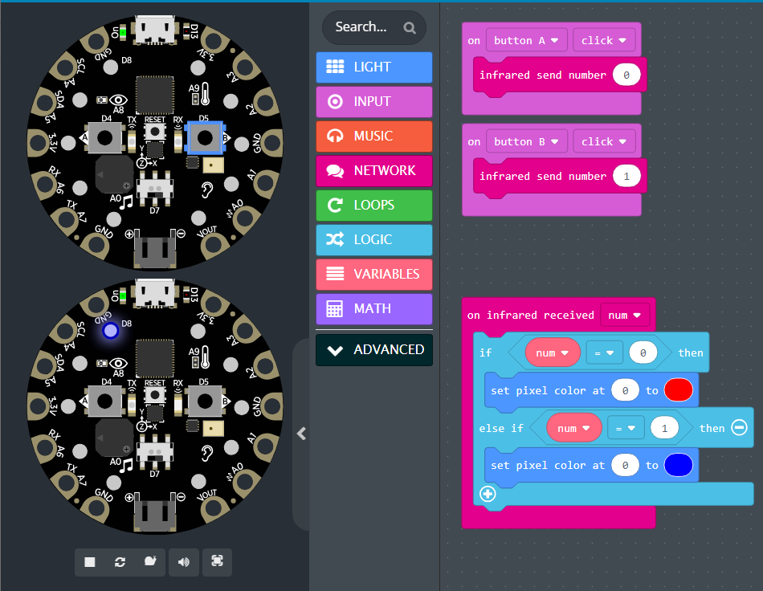
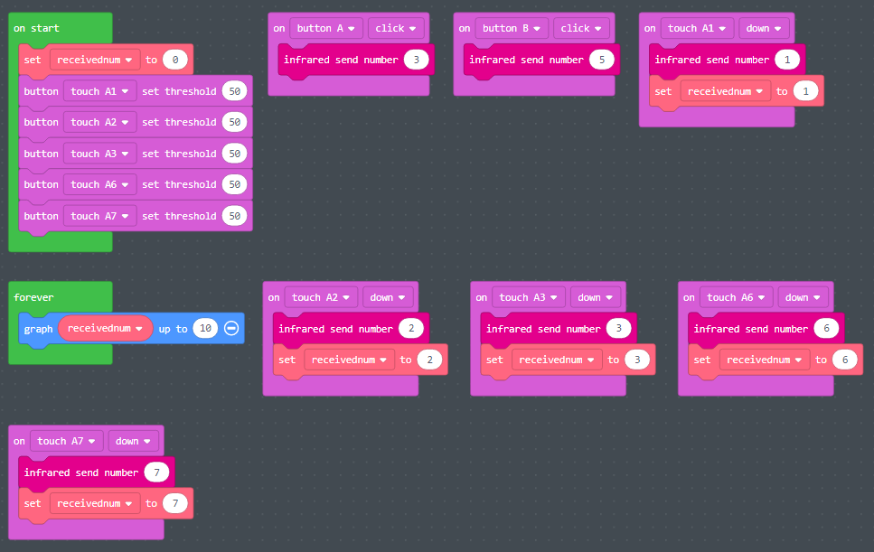
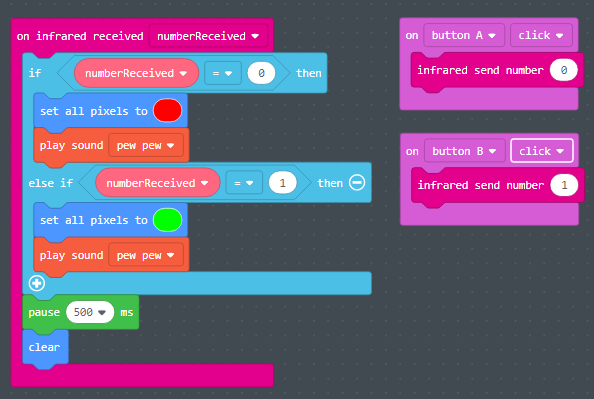

# IR Transmissor e Receptor

IR Transmissor e Receptor

- **O que é infravermelho \(IR\)?**
  - Invisível a olho nu
  - Utilizado em comunicações sem fio
  - Linha de visão: o transmissor deve estar apontado para o receptor
  - Curto alcance: 10 a 20 metros
- **Exemplos de dispositivos infravermelhos de consumo**
  - Controle remoto de TV
  - Controle de video game
- **IR no CPX**
  - O dispositivo CPX possui um transmissor e um receptor
  - Configuração 1: dois dispositivos CPX
    - Um CPX envia um valor e o outro o recebe
  - Configuração 2: un dispositivo CPX e um mini controle remoto
    - O controle remoto envia um valor e o CPX recebe
    - Esta configuração será usada para o projeto final

# Infravermelho no MakeCode

O simulador apresenta dois dispositivos CPX: um atuará como o transmissor remoto \(remetente\) e o outro receberá.

O receptor utiliza um bloco lógico para realizar diferentes ações com base no valor transmitido.

Blocos IR disponíveis em **Network**

Por padrão, o valor recebido é atribuído à variável **num**

# Exemplo de Infravermelho # 1

- A função "on infrared received" corresponde ao receptor.
- A função "infrared send number" corresponde ao transmissor.
- Usamos as entradas para transmitir diferentes números infravermelhos.
- Precisamos construir a lógica dentro da função "on infrared received”" para executar diferentes ações com base no número recebido.

# Dicas

- O bloco lógico do receptor CPX pode se tornar bastante grande
  - _Dica: use funções para dividir o código em partes menores\, pedaços mais gerenciáveis_
- Se ambos os dispositivos CPX forem programados da mesma forma, qualquer um deles poderá atuar como emissor ou receptor.
- Com 2 botões e 7 sensores de toque, o dispositivo CPX pode ser facilmente programado para enviar 9 valores diferentes.

# Exercício de Infravermelho \#2 \(Laser Tag\)

