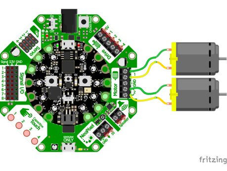

# O que são microchips Crickit?

- Os microchips Crickit são usados ​​junto com os microchips CPX porque podem controlar motores mais potentes que o CPX não conseguiria alimentar sozinho.
- Eles também têm a capacidade de conectar sensores adicionais ao Crickit.

# Exemplo de Crickit

- Para ligar os motores, você precisa chamar a função "crickit run motor" para ambos os motores.
- Podemos ligar o motor a uma porcentagem (número) que definimos dentro de duas variáveis ​​chamadas "throttleleft" e "throttleright".
- Podemos alterar o valor dessas variáveis ​​em diferentes pontos do programa, dependendo se queremos que o robô vá para frente, para trás, para a esquerda ou para a direita.

# Exercício de Crickit #1

