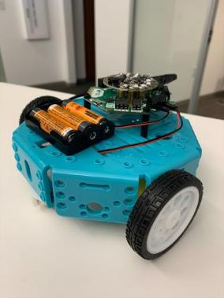
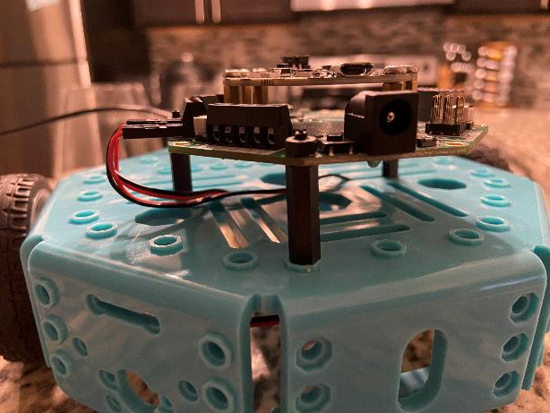
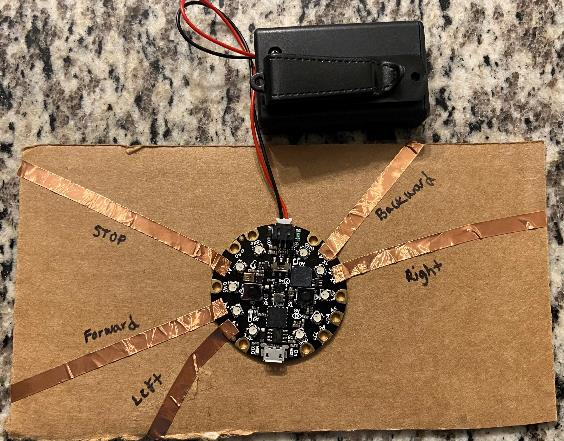
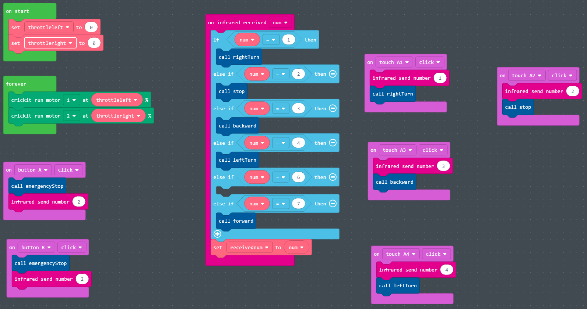
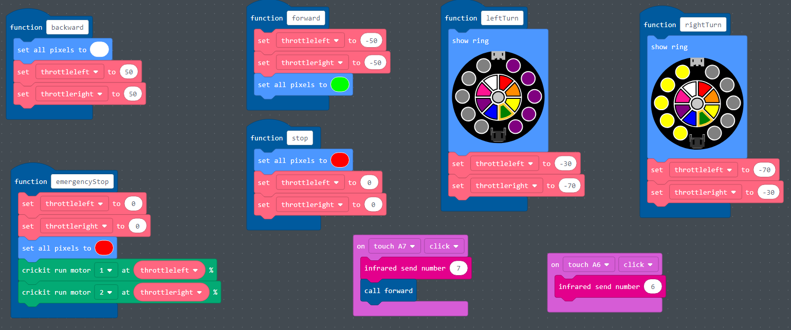

# Vídeo da montagem

[Assembly Walkthrough](https://video.morganstanley.com/#/videos/502f9fb8-00cc-4b84-950d-110df6d1edc4)

**Materiais necessários:**

- Pacote de baterias
- 3 pilhas AA
- Microchip CPX
- Crickit
- 2 motores
- 2 rodas
- Chassi do robô
- 4 parafusos M3 longos + porcas
- 4 parafusos M3 curtos + porcas
- 3 espaçadores, parafusos e porcas de nylon preto

# Prenda os motores

- Fixe um motor em cada lado
- Use parafusos M3 x 30 mm e porcas M3 \(Caixa pequena\)\.
- Passe os fios do motor pelo chassi.
- Fixe as rodas giratórias.
- Fixe as rodas giratórias em cada lado.
- Use parafusos M3 x 16 mm e porcas M3 \(Caixa grande\).

# Montagem do Robô – Prendendo CPX ao Crickit

- Fixe o CPX ao Crickit
- Utilize os espaçadores e parafusos de metal (dentro da bolsa do Crickit)
- O micro USB do CPX deve estar alinhado com a fonte de alimentação do Crickit

# Montagem do Robô – Prendendo CPX / Crickit ao corpo do robô

- Fixe o CPX / Crickit ao corpo do robô
- Espaçadores de nylon macho para fêmea \(M3 x 20 mm\)
- Parafusos de nylon \(M3 x 12 mm\)
- Porcas de nylon \(M3\)

# Montagem do Robô – Prendendo fios do motor e fonte de alimentação

- Conecte os fios do motor e a fonte de alimentação ao Crickit
- Parafuse os fios do motor nas portas.
- Preto, Vermelho, Preto, Vermelho
- Passe a fonte de alimentação por baixo do corpo e até a porta de alimentação.

# Conjunto remoto infravermelho

**Materiais necessários:**

- Bateria
- Pilhas AAA
- Microchip CPX
- Fita de cobre
- Caneta
- Papelão

**Etapas:**

- Passe a fita de cobre do sensor A1 – PARE
- Passe a fita de cobre do sensor A2 – FRENTE
- Passe a fita de cobre do sensor A3 – ESQUERDA
- Passe a fita de cobre do sensor A6 – DIREITA
- Passe a fita de cobre do sensor A7 \- PARA TRÁS

# Código final

[Final Project Code](https://makecode.adafruit.com/63713-87319-45072-61482)

