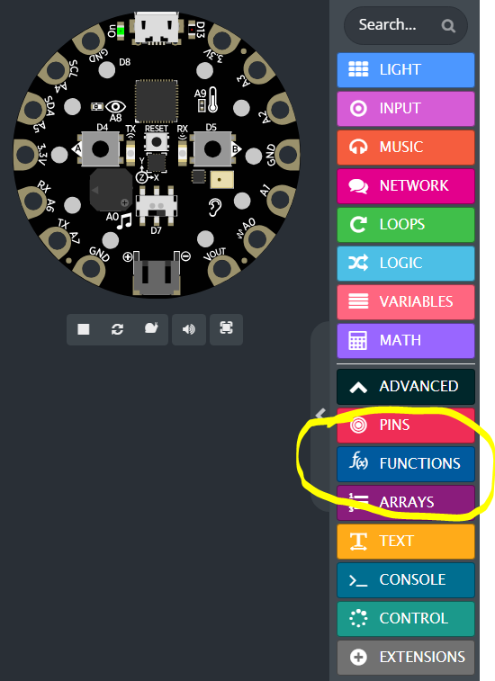
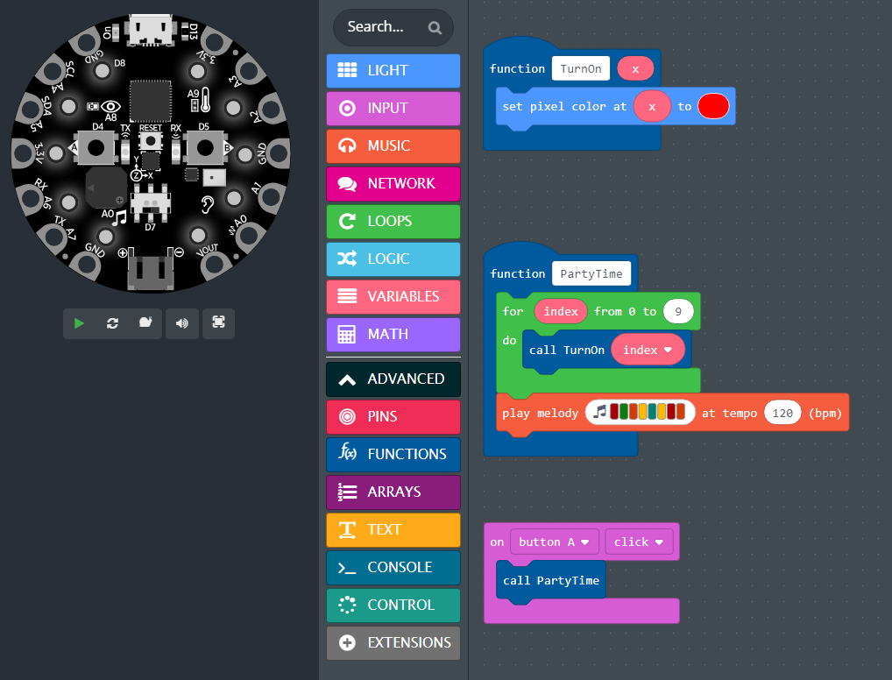

- **O que são funções?**
  - Funções são blocos de construção fundamentais de programas\.
  - Elas permitem nomear um conjunto de comandos\.
  - Uma vez definida, uma função pode ser reutilizada indefinidamente\.
- **Exemplo de funções:**
  - Add\( *x\, y* \)
    - Pegue dois números *x* e *y* \, e retorne a soma *x\+y*
    - \(recebe entrada e retorna saída\)
  - TurnOn\( *x* \)
    - Pegue um número entre 0 e 9 e ligue o LED
    - \(recebe entrada\, não retorna saída\)
  - PartyTime\(\)
    - Defina todos os pixels para vermelho\, toque uma música
    - \(não recebe entrada\, não retorna saída\)

## Criando Funções

## Definindo e Chamando Funções

