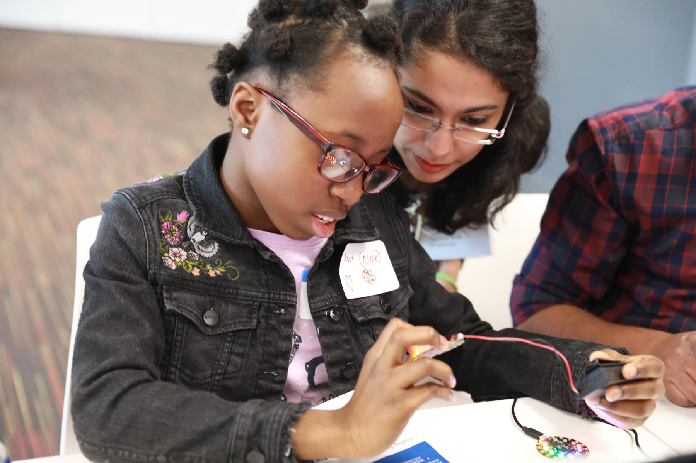

## Motivation

  <section className="column">
    In order to fill the tech- and science-focused roles of the future,
    technologists nationwide should focus on providing youth from
    underserved communities the resources to promote computer science
    advocacy now.

    Students from underprivileged backgrounds are 8 to 10 times more likely
    to pursue college degrees in computer science if they have taken AP
    computer science in high school. We can project that these odds will
    only increase if studentds are given even earlier exposure to software
    and hardware technologies.

    Through this Maker workshop, technologists who are passionate about
    bridging this gap will develop a blueprint that can be leveraged to
    facilitate tech exploration workshops for underserved youth in their
    communities. Marrying knowledge of Python programming and Adafruit
    Circuit Playground Express devices, their students will be empowered to
    become makers of technology.

  </section>
  <section className="column">
    <blockquote>
      Minority students in under-resourced or underperforming school
      districts are at risk of being left behind, a scenario that has far-reaching socioeconomic consequences for the United States.
    </blockquote>
  </section>

## The Case for Change

  <section className="column">
    ### 1.4m
    

      Number of computer-science-related jobs available in 2021
    

    ### 400,000
    

      Number of graduates with the skills to apply for those jobs
    

  </section>
  <section className="column">
    ### 8-10x
    

      Increase Likelihood that students from underserved backgrounds will
      pursue degrees in computer science if they have taken computer science
      in high school
    

  </section>

### Goals
- Unveil the magic behind technology to young people with limited access to computer science education through the Adafruit CPX.
- Draw best practices from a Morgan Stanley employee designed and run program.
- Leave with a Makerspace workshop blueprint for youth in your community.

### Audience

This workshop caters to software and hardware enthusiasts. It is especially useful to those who are excited about leveraging devices to teach coding and electronics to young programmers!

- College Students
- Educators
- Corporate Technologists
- Start Up Technologists
- Non Profit Organization Technologists
- Hobbyists
- Parents with children learning from home

